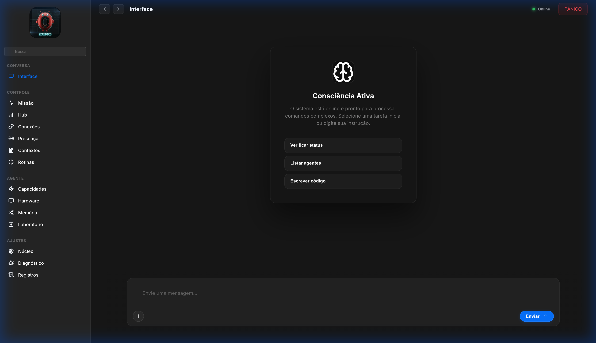
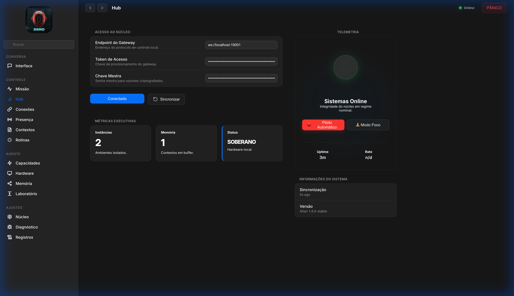
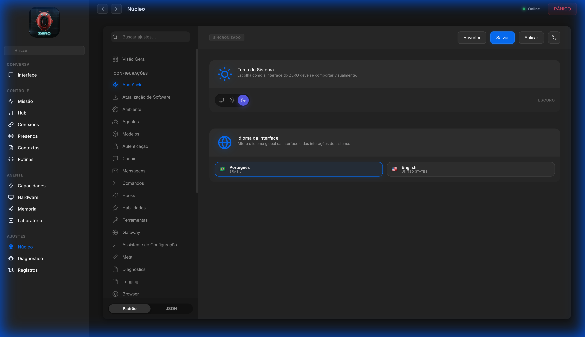
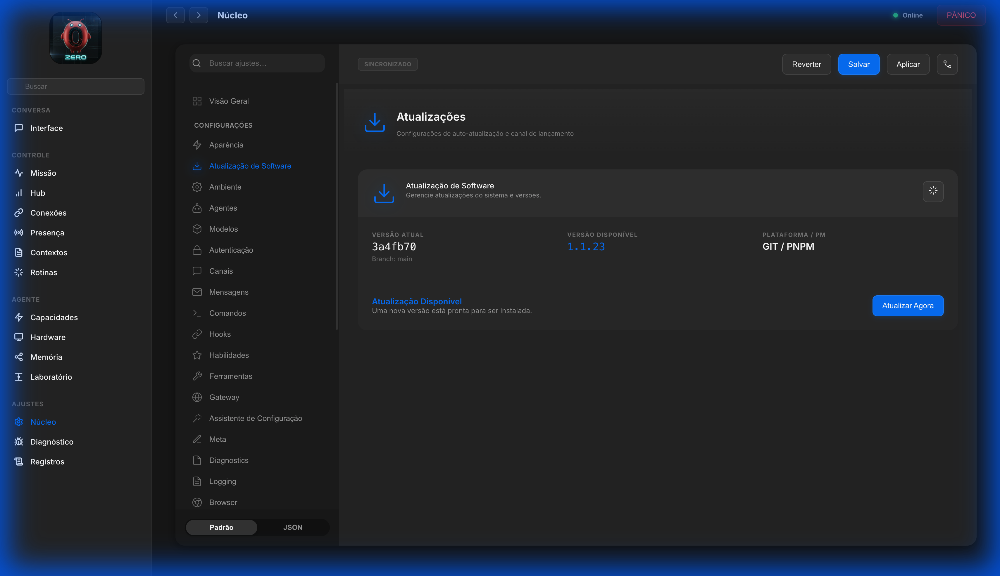
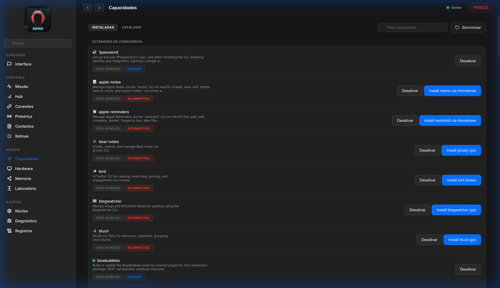

# ∅ ZERO — Sistema Operacional Pessoal Agêntico

<p align="center">
  
</p>

> **"A infraestrutura invisível é a mais resiliente."** ∅

<p align="center">
  <a href="https://github.com/zero/zero/actions/workflows/ci.yml?branch=main"></a>
  <a href="LICENSE"></a>
  <a href="https://github.com/zero/zero"></a>
  <a href="CHANGELOG.md"></a>
</p>

**ZERO** não é apenas uma distribuição de IA; é o ponto de singularidade onde a computação pessoal encontra a autonomia soberana. Projetado como um **Sistema Operacional de Agente**, o ZERO transforma sua máquina em uma fortaleza de inteligência local, eliminando a latência da nuvem e a vigilância corporativa.

---

## 🛑 Para Quem é (e Para Quem Não É)

**"A magia deve ser invisível."**

Se você é um usuário comum, a engenharia pesada abaixo (Rust, WebSockets, Vetores) **não é da sua conta**. O ZERO foi desenhado para abstrair essa complexidade brutal em uma interface fluida que *simplesmente funciona*.

- **Para o Usuário**: Você recebe um Assistente Pessoal incansável, privado e soberano. Instale, use, governe sua vida digital. O resto é detalhe de implementação.
- **Para o Engenheiro**: Você recebe um playground de arquitetura agêntica de ponta, modular e auditável.

> *O verdadeiro gênio não está em criar complexidade, mas em torná-la invisível e acessível.*

---

## ⚡️ O Que o ZERO Faz Por Você?

Enquanto outros sistemas te aprisionam em assinaturas ou vendem seus dados, o ZERO te liberta:

1. **Soberania de Comunicação**:
    - **Unifica** WhatsApp, Telegram, Discord e Slack em um único fluxo de consciência.
    - *Exemplo*: *"Resuma todas as mensagens de trabalho das últimas 2 horas e me diga apenas o que exige ação imediata."*
2. **Memória Pessoal Infinita (RAG Local)**:
    - Indexa seus arquivos locais (PDFs, Docs, Código) sem enviá-los para a nuvem.
    - *Exemplo*: *"Encontre aquele contrato que assinei em 2023 sobre 'prestação de serviços' e me diga a cláusula de rescisão."*
3. **Execução de Tarefas Reais (Agentic)**:
    - Não apenas "fala", ele **faz**. Agenda reuniões, envia e-mails, controla o terminal.
    - *Exemplo*: *"Verifique meu calendário, cancele a reunião das 15h e avise o time por Slack que estou focado no deploy."*
4. **Codificação Autônoma**:
    - Atua como um Engenheiro de Software Sênior que conhece todo o seu codebase local.
    - *Exemplo*: *"Analise os logs de erro do projeto X e proponha um fix para o vazamento de memória."*

---

## ♻️ Origens e Evolução (OpenClaw)

O ZERO não nasceu no vácuo. Ele é um "Hard Fork" e evolução direta do **OpenClaw** (anteriormente conhecido como *Clawdbot* e *Moltbot*).

- **Fundação Original (2025-2026)**: Criado por **Peter Steinberger**, o OpenClaw estabeleceu o padrão para agentes pessoais locais em TypeScript/Swift, atingindo >100k stars no GitHub. Agradecemos à visão original de Steinberger de criar uma IA que "roda no seu dispositivo".
  - *Repositório Original*: [github.com/openclaw/openclaw](https://github.com/openclaw/openclaw)
- **Aprendizado Contínuo (Issues & Bugs)**:
  - Monitoramos ativamente as *Issues* do repositório upstream. O que falha lá, corrigimos aqui.
  - **Exemplos Reais de Correções no ZERO**:
    1. **Segurança (CVE-2026-25253)**: O OpenClaw sofria com WebSockets não autenticados e "Skills" maliciosas no marketplace. O **Zero Sentinel** implementa sandbox rígida e não carrega código remoto não assinado.
    2. **"Token Burning" (Custo Infinito)**: O OpenClaw enviava todo o histórico a cada "heartbeat". O **ZERO** utiliza um algoritmo de *Context Compaction* (Rust) que sumariza memórias antigas, mantendo o custo de tokens controlado.
    3. **Memory Leaks no Gateway**: Sessões longas no OpenClaw travavam o Node.js. Movemos a gestão de estado crítico e VAD para o **Rust Core**, eliminando vazamentos de memória (GC pressure).
- **Divergência Tecnológica ZERO**:
  - Enquanto o OpenClaw foca em pureza TypeScript/Swift, o **ZERO** adotou uma arquitetura híbrida **Rust + Node.js** para performance crítica.
  - Introduzimos o **Zero Sentinel** para mitigar riscos de segurança que a versão original não cobria (Firewall de PII e Injeção).
  - Reconstruímos a UI (Altair) focada em "Sci-Fi Premium" versus a UI utilitária original.

> *Honramos o código que veio antes (Peter Steinberger & Community), enquanto construímos o futuro soberano que precisamos agora.*

---

## 🏛️ Filosofia e Princípios de Engenharia

O ecossistema ZERO é construído sobre quatro pilares fundamentais, validados por rigorosos padrões de arquitetura de software:

1. **Soberania Local-First (O "Google" Pessoal Éticoy)**:
   - *Visão*: O Google organizou a web pública; o **ZERO** organiza a sua vida privada.
   - *Execução*: Todos os vetores de dados, memórias e logs residem no seu diretório `~/.zero`. Diferente da nuvem, onde a escala custa privacidade, aqui a escalar a inteligência não custa sua liberdade. Indexamos sua existência digital para *você*, e só para você.
2. **Arquitetura Híbrida de Performance**: Um núcleo de performance crítica escrito em **Rust** (gerenciando VAD, telemetria de densidade e criptografia) integra-se perfeitamente com a flexibilidade do **TypeScript** para orquestração de canais.
3. **Segurança de Elite (OWASP LLM Top 10)**: O ZERO é governado pelo **Zero Sentinel**, um firewall de IA proativo que mitiga Injeção de Prompt, vazamento de PII e alucinações via validação forçada de Chain-of-Thought (CoT) e auditoria de segredos via engine Rust nativa.
4. **Arquitetura ClearCode**: Rigor técnico com imposição de limites de complexidade (máximo de 500 linhas por arquivo). Garantimos que o sistema seja modular e auditável; recentemente refatoramos os módulos críticos `MemoryIndexManager` e `MessageActionRunner` para cumprir este rigor.
5. **Autonomia Agêntica Proativa**: Através do **Nudge Engine**, o sistema transcende a reatividade, antecipando necessidades baseadas em contexto e operando em loops de deliberação de alta fidelidade.

---

## 🛸 Interface Altair: O Console de Comando

A **Interface Altair** é o nome oficial do console de gerenciamento baseado em navegador (web-based) do ecossistema ZERO.

Enquanto o **Gateway** opera nos bastidores (como o motor/cérebro do sistema), a **Altair** é a "cabine de comando" visual que você utiliza para interagir com ele.

### 1. Centro de Orquestração (Hub)

A Altair permite que você visualize e controle todos os módulos do sistema em um único lugar, sem precisar usar apenas a linha de comando (CLI). Nela você gerencia:

- **Contextos (Sessões)**: Onde conversas e memórias são visualizadas e persistidas.
- **Conexões (Canais)**: Integrações com Telegram, Discord, Slack, WhatsApp, etc.
- **Capacidades (Skills)**: Extensões e plugins que dão novos "poderes" ao seu agente.
- **Hardware & Presença**: Telemetria em tempo real de dispositivos conectados e instâncias ativas.

### 2. Estética "Premium" e Futurista

O design da Altair é inspirado em sistemas de telemetria avançada (Sci-Fi UI), utilizando uma estética de "painel de missão" ou "ponte de comando".

**Por que "Interface Altair"?**
Altair é a estrela mais brilhante da constelação de Águia (Aquila). Historicamente, é uma das estrelas usadas pelos navegadores para encontrar seu caminho. No ecossistema ZERO, a Interface Altair cumpre este papel: ela é o ponto de luz e referência que permite ao usuário "navegar" com segurança e clareza pelo vasto e complexo oceano de processos cognitivos e dados da IA.

### 3. Ponte de Telemetria (Realtime)

Ela funciona consumindo a API do Gateway via **WebSockets**. Isso significa que as informações que você vê (como uso de memória, status do motor de inferência e logs de eventos) são atualizadas em tempo real, permitindo diagnóstico instantâneo da saúde do sistema.

### 4. Laboratório e Debug

Dentro da Altair existe o **Playground (Laboratório)**, onde você pode:

- Testar respostas da IA em ambiente controlado.
- Verificar o raciocínio do agente (CoT - Chain of Thought).
- Auditar a segurança das interações e testar ferramentas (tools).

> *Se o ZERO é o sistema operacional da inteligência, a Altair é o monitor e o painel de controle que torna essa inteligência tangível e operável.*

---

## 🎨 Galeria de Interface (Experiência Altair)

Visualize o **ZERO** em operação. Estes são registros reais da interface de controle unificada:

| Chat & Assistente (Interface Altair) | Hub de Controle (Telemetria) |
| :--- | :--- |
|  |  |
| *Modo Foco com comandos proativos e sugestões inteligentes.* | *Visão consolidada da saúde do sistema e conexões.* |

| Núcleo do Sistema (Aparência) | Atualização de Software (Updates) |
| :--- | :--- |
|  |  |
| *Controle granular de cada parâmetro do seu Sistema.* | *Gerenciamento proativo de versões e integridade via Git/PNPM.* |

| Catálogo de Habilidades (Marketplace) |
| :--- |
|  |
| *Extensões prontas para expandir os poderes da sua IA.* |

---

## 📐 Blueprints & Anatomia Sistêmica

O ZERO é projetado com rigor de engenharia aeronáutica. Abaixo, o Blueprint da nossa arquitetura agêntica:

<p align="center">
  
</p>

*Esquema do Córtex Agêntico: Integração entre o Motor Rust e a Interface Altair.*

---

---

## 🚀 Guia de Início Rápido para Desenvolvedores

### 🛠️ Pré-requisitos

- **Runtime**: Node.js ≥ 22.x
- **Package Manager**: pnpm (recomendado)
- **Rust Toolchain**: Requerido para compilação nativa do `rust-core`.

#### 💻 Requisitos de Sistema (Hardware)

Para garantir estabilidade e performance:

- **🖥️ Desktop Local (Mac/Windows/Linux)**:
  - **Mínimo**: 8 GB RAM (O ZERO consome pouco, mas o OS e Browser exigem o restante).
  - **Recomendado**: 16 GB+ RAM (Para uso fluido com VS Code + Browser + ZERO).
- **🌐 Servidor / VPS (Cloud)**:
  - **Mínimo**: 1 vCPU, 1 GB RAM (com Swap), 20 GB SSD.
  - **Ideal**: 2 vCPUs, 2 GB+ RAM, 40 GB+ SSD.
  - **Elite**: 4 vCPUs, 4 GB+ RAM (Para automação de navegador e múltiplos agentes).

### 📦 Instalação "One-Liner" (Simplificada)

Escolha o método que melhor se adapta ao seu ambiente:

#### 🖥️ Local (Mac/Linux/Windows WSL)

Ideal para desenvolvedores e uso diário no computador pessoal.

```bash
curl -fsSL https://raw.githubusercontent.com/Lex-1401/ZERO/main/quickstart.sh | bash
```

#### 🌐 VPS / Nuvem (Docker)

Ideal para manter o ZERO online 24/7 com isolamento total.

```bash
curl -fsSL https://raw.githubusercontent.com/Lex-1401/ZERO/main/deploy-docker.sh | bash
```

### 📦 Instalação do Workspace de Desenvolvimento (Manual)

   ```bash
   git clone https://github.com/zero/zero.git
   cd zero
   pnpm install
   ```

1. **Compilação de Subsistemas**:

    ```bash
    pnpm build:full  # Compila Subsistemas (Rust), UI e Núcleo TS
    ```

2. **Orquestração Inicial**:

    ```bash
    pnpm zero onboard --install-daemon
    ```

    *💡 Se o comando acima falhar com "command not found", certifique-se de que o pnpm está configurado corretamente (`pnpm setup`) ou prefira usar `pnpm zero onboard`.*

   *Isso iniciará o mago de configuração que preparará sua "Origem" (diretório Home), chaves de API e canais de mensageria.*

---

## 📂 Anatomia do Sistema (Developer Layout)

| Diretório | Responsabilidade Técnica |
| :--- | :--- |
| `src/gateway/` | **Medula Espinhal**: Servidor WebSocket RPC, roteamento e coordenação de nós. |
| `src/agents/` | **Córtex**: Lógica do Agente Pi, governança de prompt e Runners de LLM. |
| `rust-core/` | **Motor de Alta Densidade**: Telemetria, VAD e criptografia via NAPI-RS. |
| `src/channels/` | **Sentidos**: Adaptadores para WhatsApp, Telegram, Discord, Slack, iMessage. |
| `ui/` | **Plano de Controle**: Interface Altair desenvolvida com estética premium. |
| `skills/` | **Habilidades**: Extensões isoladas que expandem as capacidades cognitivas do sistema. |
| `src/realtime/` | **Percepção**: Motor multimodal de baixa latência (WebSocket) para streaming de áudio/vídeo e roteamento semântico. |
| `src/voice/` | **Voz Nativa**: Módulo dedicado para processamento e síntese de voz, permitindo chamadas e comandos por áudio. |
| `src/roles/` | **Governança**: Sistema de permissões granulado (Levels 1-5) para controle de acesso agêntico. |

---

## ∅ Manifesto ZERO

**ZERO não é apenas um nome. É um conceito vivo.**

- **Vazio que contém o Infinito**: Como um agente de IA com acesso total ao seu hardware, o ZERO parece invisível, mas é ilimitado. É a poesia algorítmica de um sistema que não pede atenção, mas entrega liberdade.
- **Ponto de Origem**: Tudo começa do zero. Representa o "Ponto Zero" ou a "Origem". É a busca pela **Latência Zero**, pela **Confiança Zero (Zero Trust)** e pelo retorno à soberania total, onde o controle começa e termina no usuário, sem intermediários. É o reset necessário — o "zero-bala" — para uma computação verdadeiramente pessoal.
- **Símbolo de Subversão**: O zero que quebra sistemas e anula pressupostos. É a neurodivergência aplicada ao código: o que a sociedade diz que "não se encaixa" é, na verdade, o fundamento de tudo.
- **Humildade Radical**: Um ato de defesa e ofensa simultâneos. "Você disse que sou ninguém? Agora vejo que sou tudo."

> **"O que você não pode ver trabalhando é o que está fazendo funcionar."**

O ZERO opera em silêncio. Invisível. Negligenciado pelos gigantes, mas sustentando sua nova infraestrutura soberana. Quando perguntarem "o que é isso?", não explique. Mostre funcionando.

### ∅ Conclusão do Manifesto

---

## 🛡️ Protocolo de Segurança e Sentinel

O módulo **Zero Sentinel** implementa defesas ativas contra ameaças vetoriais:

<p align="center">
  
</p>

- **LLM Security Guardrails (OWASP Top 10)**: Mitigação ativa de Prompt Injection, Indirect Injection e Jailbreaks.
- **Protocolo CoT com Self-Correction**: O modelo é forçado a deliberar em blocos `<think>`, garantindo lógica antes da ação.
- **Firewall de PII & Secrets**: Escaneamento em tempo real (engine Rust) de CPFs, CNPJs, Emails e chaves de API.
- **Sandbox Isolate**: Execução de ferramentas e navegação em ambientes isolados (Docker/Firecracker) com sanitização de caminhos de arquivos.
- **Stealth Mode & Lockdown**: Ocultação instantânea de dados sensíveis e congelamento de emergência via `zero panic`.
- **Local Sovereignty**: Processamento local prioritário, garantindo compliance com LGPD e GDPR por design.

### 🔬 Engenharia de Privacidade (Deep Dive)

*Respondendo à provocação: "Os algoritmos de detecção são realmente eficazes?"*

O **Zero Sentinel** não é apenas um filtro de palavras-chave. Ele opera no nível do kernel agêntico em **Rust** para garantir latência sub-milissegundo:

1. **Detecção de Alta Entropia (Shannon Entropy)**:
    - Algoritmos tradicionais falham em detectar chaves de API novas ou incomuns. O Sentinel calcula a entropia da string em janelas deslizantes. Se um bloco de texto parece "matematicamente aleatório" (como uma chave privada `sk-abc123...`), ele é incinerado antes de tocar o log ou o prompt.
2. **Regex Nativa (Rust `regex` crate)**:
    - Compilação AOT (Ahead-Of-Time) de padrões complexos para CPF, CNPJ e Cartões de Crédito. O custo de sanitizar 1MB de texto é desprezível, permitindo que *tudo* seja auditado em tempo real sem "lag" na conversa.
3. **O Trade-off Autonomia vs. Inteligência Coletiva**:
    - O ZERO rejeita a premissa de que a inteligência exige telemetria centralizada.
    - **Modelo Mental**: Utilizamos o "conhecimento coletivo congelado" (o LLM pré-treinado) e o especializamos com o "contexto soberano vivo" (seu RAG local). Você não precisa enviar seus dados para treinar a IA dos outros; a IA vem treinada para servir os *seus* dados.

> *Segurança não é uma feature. É o estado padrão.*

---

## 🤝 Contribuição e Vibração

Estamos construindo a infraestrutura do amanhã. Contribuições são bem-vindas de engenheiros que buscam a soberania tecnológica.

- **Padrões de Docstrings**: Seguimos o padrão JSDoc rigoroso para documentação técnica.
- **Pilha Moderna**: TS (Node 22), Rust (napi-rs), Vitest, Playwright.

Este repositório é uma evolução do Clawdbot, adaptado e re-arquitetado como **ZERO** por **Leandro Azevedo** para soberania brasileira, incluindo segurança avançada e suporte nativo a hardware local.

### 🛠️ Solução de Problemas Comuns

- **Erro `command not found` após instalação**:
  Reinicie seu terminal ou rode `source ~/.bashrc` (ou `.zshrc`). Se persistir, use o caminho completo: `pnpm zero`.

- **Acesso Externo (VPS/LAN)**:
  Por segurança, o ZERO ouve apenas em `localhost`. Para acessar externamente:
  1. Use um túnel SSH (Recomendado): `ssh -L 18789:localhost:18789 user@vps_ip`
  2. Verifique a config `~/.zero/zero.json`. O modo `"bind": "lan"` permite conexões externas via `0.0.0.0` (Use com cautela em ambientes públicos!).

---

*ZERO é uma ferramenta de precisão. Use-a com intenção.*
