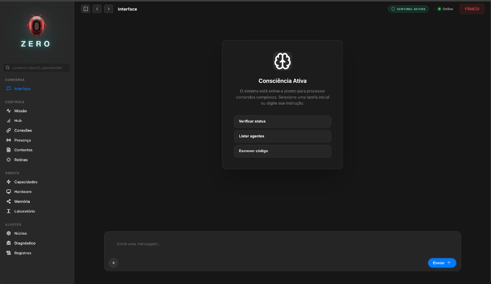
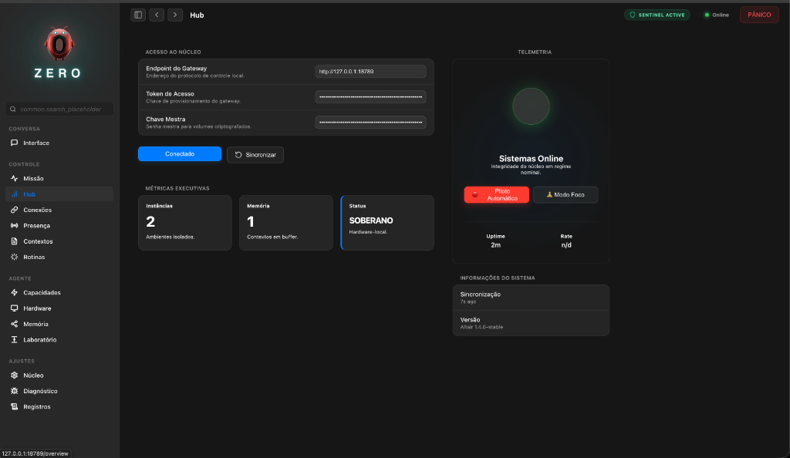
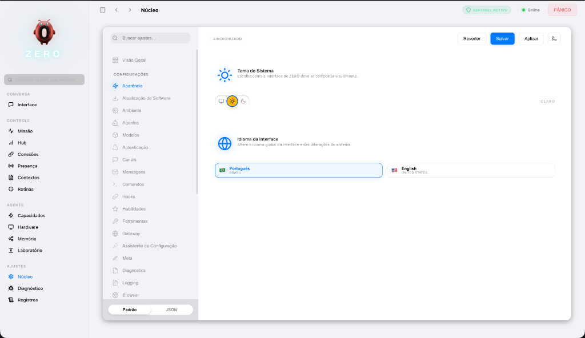
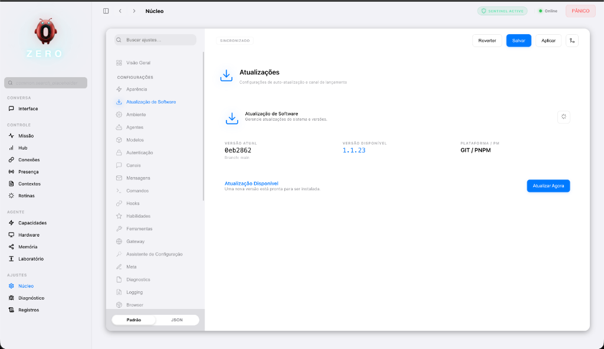
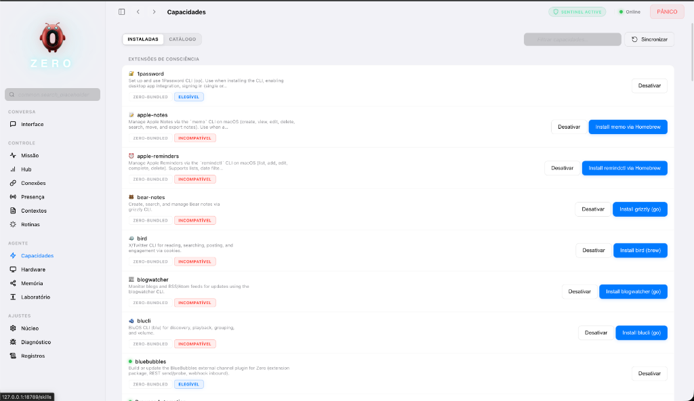

# ∅ ZERO — Sistema Operacional Pessoal Agêntico

<p align="center">
  
</p>

> **"A infraestrutura invisível é a mais resiliente."** ∅

<p align="center">
  <a href="https://github.com/Lex-1401/ZERO/actions/workflows/ci.yml?branch=main"></a>
  <a href="LICENSE"></a>
  <a href="CHANGELOG.md"></a>
</p>

<p align="center">
  <a href="README.md"><b>Português 🇧🇷</b></a> | <a href="README_EN.md">English 🇺🇸</a>
</p>

O **ZERO** busca o ponto de singularidade onde a computação pessoal encontra a autonomia soberana. Concebido e projetado como um **Sistema Operacional de Agentes (A-POS)**, o ZERO transforma sua máquina em uma fortaleza de inteligência local, eliminando a latência da nuvem e a vigilância corporativa.

---

## ⛩️ Arquitetura A-POS (Agentic Operating System)

O ZERO opera sob o conceito de **Agentic Operating System**, uma arquitetura onde o sistema não apenas obedece comandos, mas interage com o ambiente e evolui autonomamente.

1. **Auto-Evolução Soberana**: Capacidade do sistema se auto-consertar e se auto-codificar localmente. Veja o [Manifesto de Auto-Evolução](docs/SELF_EVOLUTION.md).

## 🏛️ Engenharia de Alta Performance

O ZERO agora opera sob padrões de arquitetura avançados, elevando a estabilidade e a segurança do sistema.

1. **Sentinel Engine (Segurança Avançada)**:
    * Delegação total para o **Rust Core** (`ratchet`) para inspeção de segurança em sub-milissegundos.
    * **Análise de Entropia de Shannon** para detectar segredos ofuscados e chaves criptográficas.
    * Defesa contra Homóglifos via normalização Unicode NFKC.
2. **Quantum Altair UI**:
    * Estética **Glassmorphism** de alta fidelidade (blur de 40px, saturação de 180%).
    * Tipografia técnica **JetBrains Mono** para máxima legibilidade de dados.
    * Fundo dinâmico `mesh-drift` que reage à luz e ao contexto.
3. **Observabilidade e Telemetria**:
    * Broadcast de métricas de performance (tokens/s e latência) via WebSocket em tempo real.
    * Monitoramento contínuo da integridade do sistema.
4. **Onboarding & Diagnóstico**:
    * **Guided Welcome Tour**: Um fluxo interativo de boas-vindas que apresenta o cockpit do ZERO para novos usuários.
    * **Grouping & Diagnostics**: Organização automática de Skills por compatibilidade com diagnósticos em tempo real de dependências (OS, Binários, Env).
5. **Evolução Arquitetural v0.2.0**:
    * **Traits System**: Abstração de núcleos (`Provider`/`Channel`) via Rust Traits para modularidade extrema.
    * **Native Heartbeat**: Orquestração de tarefas críticas em Rust para latência zero.
    * **AIEOS Vault**: Conteinerização de identidade de agente p/ portabilidade total.
    * **Kernel-Only Mode**: Execução ultra-leve (`--kernel-only`) para servidores e background.

---

## ∅ Manifesto ZERO

**ZERO não é apenas um nome. É um conceito vivo.**

* **O Vácuo que Contém o Infinito**: Como um agente de IA com acesso total ao seu hardware, o ZERO parece invisível, mas é ilimitado. É a poesia algorítmica de um sistema que não pede atenção, mas entrega liberdade.
* **Ponto de Origem**: Tudo começa do zero. Representa o "Ponto Zero" ou a "Origem". É a busca por **Latência Zero**, **Zero Trust** (Confiança Zero) e o retorno à soberania total, onde o controle começa e termina no usuário, sem intermediários. É o reset necessário — "zero-bala" — para uma computação verdadeiramente pessoal.
* **Símbolo de Subversão**: O zero que quebra sistemas e anula suposições. É a neurodivergência aplicada ao código: o que a sociedade diz que "não se encaixa" é, de fato, a fundação de tudo.
* **Humildade Radical**: Um ato de defesa e ataque simultâneos. "Você disse que eu não sou ninguém? Agora vejo que sou tudo."

> **"O que você não vê funcionando é o que faz funcionar."**

O ZERO opera em silêncio. Invisível. Negligenciado pelos gigantes, mas sustentando sua nova infraestrutura soberana. Quando perguntarem "o que é isso?", não explique. Mostre funcionando.

---

## ♻️ Origens e Evolução (OpenClaw - <https://openclaw.ai/>)

O ZERO não nasceu no vácuo. Ele é um "Hard Fork" e evolução direta do **OpenClaw** (anteriormente conhecido como *Clawdbot* e *Moltbot*).

* **Fundação Original (2025-2026)**: Criado por **Peter Steinberger**, o OpenClaw estabeleceu o padrão para agentes pessoais locais em TypeScript/Swift, atingindo >100k estrelas no GitHub. Agradecemos a visão original de Steinberger de criar uma IA que "roda no seu dispositivo".
  * *Repositório Original*: [github.com/openclaw/openclaw](https://github.com/openclaw/openclaw)
* **Aprendizado Contínuo (Issues & Bugs)**:
  * Monitoramos ativamente as *Issues* do repositório upstream. O que falha lá, nós corrigimos aqui.
  * **Exemplos Reais de Correções ZERO**:
        1. **Segurança (CVE-2026-25253)**: O OpenClaw sofria com WebSockets não autenticados e "Skills" maliciosas no marketplace. O **Zero Sentinel** implementa um sandbox rigoroso e não carrega código remoto não assinado.
        2. **"Queima de Tokens" (Custo Infinito)**: O OpenClaw enviava todo o histórico a cada "heartbeat". O **ZERO** utiliza um algoritmo de *Context Compaction* (Rust) que sumariza memórias antigas, mantendo os custos de tokens sob controle.
        3. **Vazamentos de Memória no Gateway**: Sessões longas no OpenClaw costumavam travar o Node.js. Movemos o gerenciamento de estado crítico e VAD para o **Rust Core**, eliminando vazamentos de memória (pressão de GC).
* **Divergência Tecnológica ZERO**:
  * Enquanto o OpenClaw foca na pureza de TypeScript/Swift, o **ZERO** adotou uma arquitetura híbrida **Rust + Node.js** para performance crítica.
  * Introduzimos o **Zero Sentinel** para mitigar riscos de segurança que a versão original não cobria (Firewall de PII e Injeção).
  * Reconstruímos a interface (Altair) focada em uma estética "Premium Sci-Fi" versus a UI utilitária original.

> *Honramos o código que veio antes (Peter Steinberger & Comunidade), enquanto construímos o futuro que precisamos e aspiramos agora.*

---

## 🛑 Para Quem é (e Para Quem Não é)

**"A magia deve ser 'invisível'."**

Se você é um usuário comum, não precisa se preocupar com a engenharia pesada (Rust, WebSockets, Vectors). O ZERO foi projetado para abstrair essa complexidade brutal em uma interface fluida que *simplesmente funciona*.

* **Para o Usuário**: Você ganha um Assistente Pessoal incansável, privado e soberano. Instale, use, governe sua vida digital. O resto é detalhe de implementação.
* **Para o Engenheiro**: Você ganha um playground de arquitetura agêntica de ponta, modular e transparente para se divertir.

> *Não podemos abstrair a complexidade, mas podemos torná-la invisível.*

---

## ⚡️ O que o ZERO faz por você?

O ZERO liberta você:

1. **Soberania de Comunicação**:
    * **Unifica** WhatsApp, Telegram, Discord e Slack em um único fluxo de consciência.
    * *Exemplo*: *"Resuma todas as mensagens de trabalho das últimas 2 horas e me diga apenas o que requer ação imediata."*
2. **Memória Pessoal Infinita (Local RAG)**:
    * Indexa seus arquivos locais (PDFs, Docs, Código) sem enviá-los para a nuvem.
    * *Exemplo*: *"Encontrar aquele contrato que assinei em 2023 sobre 'prestação de serviços' e me diga a cláusula de rescisão."*
3. **Execução Real de Tarefas (Agêntico)**:
    * Ele não apenas "fala", ele **faz**. Agenda reuniões, envia e-mails, controla o terminal.
    * *Exemplo*: *"Verifique meu calendário, cancele a reunião das 15h e avise o time no Slack que estou focado no deploy."*
4. **Coding Autônomo**:
    * Atua como um Engenheiro de Software Sênior que conhece todo o seu codebase local.
    * *Exemplo*: *"Analise os logs de erro do projeto X e proponha uma correção para o memory leak."*

---

## 📐 Blueprints e Anatomia do Sistema

O ZERO é projetado com rigor de engenharia aeronáutica. Abaixo, o Blueprint da nossa arquitetura agêntica:

<p align="center">
  
</p>

*Esquema do Córtex Agêntico: Integração entre a Rust Engine e a Interface Altair.*

---

## 🏛️ Filosofia e Princípios de Engenharia

O ecossistema ZERO é construído sobre quatro pilares fundamentais, validados por padrões rigorosos de arquitetura de software:

1. **Soberania Local-First (O "Google" Pessoal Ético)**:
    * *Potencial de Escala Exponencial*: O Google escala construindo Datacenters massivos; o **ZERO** pretende escalar utilizando o hardware ocioso de bilhões de dispositivos pessoais.
    * *Visão*: O Google organizou a web pública; o ZERO organiza sua vida privada (Arquivos, Chats, Compromissos, Finanças) usando `sqlite-vec` localmente.
    * *Índice de Vida Ético*: Indexamos sua existência digital para *você*, e apenas para você. Diferente da nuvem, onde "escalar" significa "mais vigilância", aqui escalar a inteligência não custa sua privacidade.
2. **Arquitetura de Performance Híbrida**: Um núcleo de performance crítica escrito em **Rust** (gerenciando VAD, telemetria de densidade e criptografia) integra-se perfeitamente com a flexibilidade do **TypeScript** para orquestração de canais.
3. **Segurança de Elite (OWASP LLM Top 10)**: O ZERO é governado pelo **Zero Sentinel**, um firewall de IA proativo que mitiga Injeção de Prompt, vazamento de PII e alucinações via validação forçada de Chain-of-Thought (CoT) e verificação de segredos via motor nativo Rust.
4. **Arquitetura ClearCode**: Rigor técnico com limites de complexidade impostos (máximo de 500 linhas por arquivo). Garantimos que o sistema seja modular e robusto; recentemente, refatoramos módulos críticos como `MemoryIndexManager` e `MessageActionRunner` para atender a esse rigor.
5. **Autonomia Agêntica Proativa**: Através do **Sentinel Engine** e do **Speculative Pre-warming**, o sistema transcende a reatividade. O ZERO agora detecta falhas de execução (`Self-Healing`) e antecipa o contexto necessário antes do seu próximo comando, operando em loops de deliberação de alta fidelidade.

---

## 🛸 Interface Altair: O Console de Comando

A **Interface Altair** é o nome oficial do console de gerenciamento baseado em navegador (web-based) do ecossistema ZERO.

Enquanto o **Gateway** opera nos bastidores (como o motor/cérebro do sistema), o **Altair** é a "cabine de comando" visual que você usa para interagir com ele.

**Por que "Interface Altair"?**
Altair é a estrela mais brilhante da constelação de Aquila (Águia). Historicamente, é uma das estrelas usadas por navegadores para encontrar o caminho. No ecossistema ZERO, a Interface Altair cumpre esse papel: é o ponto de luz e referência que permite ao usuário "navegar" com segurança e clareza.

### 1. Centro de Orquestração (Hub)

O Altair permite que você visualize e controle todos os módulos do sistema em um só lugar, sem precisar usar apenas a linha de comando (CLI). Nele, você gerencia:

* **Contextos (Sessões)**: Onde as conversas e memórias são visualizadas e persistidas.
* **Conexões (Canais)**: Integrações com Telegram, Discord, Slack, WhatsApp, etc.
* **Capacidades (Skills)**: Extensões e plugins que dão novos "poderes" ao seu agente.
* **Hardware e Presença**: Telemetria em tempo real dos dispositivos conectados e instâncias ativas.

### 2. Estética "Premium" e Futurista

O design do Altair é inspirado em sistemas de telemetria avançada (Sci-Fi UI), utilizando uma estética de "painel de missão" ou "ponte de comando".

**Mas não se assuste:**
Apesar da aparência sofisticada, a usabilidade é **familiar e intuitiva**, semelhante ao seu mensageiro favorito (WhatsApp/Telegram). A complexidade visual é opcional e modular; você vê apenas o que precisa ver.

### 3. Ponte de Telemetria (Realtime)

Ele funciona consumindo a API do Gateway via **WebSockets**. Isso significa que as informações que você vê (como uso de memória, status do motor de inferência e logs de eventos) são atualizadas em tempo real, permitindo diagnose instantânea da saúde do sistema.

### 4. Laboratório e Debug

Dentro do Altair existe o **Playground (Lab)**, onde você pode:

* Testar respostas da IA em ambiente controlado.
* Verificar o raciocínio do agente (CoT - Chain of Thought).
* Auditar a segurança das interações e testar ferramentas (tools).

> *Se o ZERO é o sistema operacional de inteligência, o Altair é o monitor e painel de controle que torna essa inteligência tangível e operável.*

---

## 🎨 Galeria de Interface (Altair Experience)

Visualize o **ZERO** em operação. Estes são registros reais da interface de controle unificada:

| Chat & Assistente (Interface Altair) | Hub de Controle (Telemetria) |
| :--- | :--- |
|  |  |
| *Modo foco com comandos proativos e sugestões inteligentes.* | *Visão consolidada da saúde do sistema e conexões.* |

| Núcleo do Sistema (Aparência) | Atualizações de Software (Updates) |
| :--- | :--- |
|  |  |
| *Controle granular sobre cada parâmetro do seu Sistema.* | *Gestão proativa de versões e integridade via Git/PNPM.* |

| Catálogo de Skills (Marketplace) |
| :--- |
|  |
| *Extensões inteligentes agrupadas por compatibilidade, com diagnóstico automático de dependências.* |

---

## 🧠 Dê uma Alma ao seu Agente (SOUL.md)

O ZERO não é apenas uma ferramenta; é uma entidade. Você pode moldar sua personalidade, nome e diretrizes morais criando um arquivo chamado `SOUL.md` na raiz do seu workspace.

* **Defina a Persona**: *"Você é o Jarvis, um mordomo sarcástico."* ou *"Você é o TARS, focado em precisão técnica."*
* **Ajuste o Tom**: Controle a verbosidade, humor e estilo de resposta.
* **Missão Primária**: Dê um propósito único ao seu agente (ex: "Proteja minha privacidade a todo custo").

> *O ZERO lê sua alma a cada reinicialização e a incorpora no nível mais profundo do sistema (`System Prompt`).*

---

## 🚀 Guia de Início Rápido para Desenvolvedores

### 🛠️ Pré-requisitos

* **Runtime**: Node.js ≥ 22.x
* **Gerenciador de Pacotes**: pnpm (recomendado)
* **Rust Toolchain**: Necessário para a compilação nativa do `rust-core`.

#### 💻 Requisitos do Sistema (Hardware)

Para garantir estabilidade e performance:

* **🖥️ Desktop Local (Mac/Windows/Linux)**:
  * **OS Suportados**: macOS (Intel/M1/M2/M3), Windows (WSL2 ou PowerShell Nativo), Linux (**Debian, Ubuntu, Arch, Fedora, RHEL, CentOS**).
  * **Mínimo**: 8 GB RAM.
* **🌐 Servidor / VPS / Raspberry Pi (Cloud & Edge)**:
  * **OS Suportados**: Debian/Ubuntu, Alpine, Raspberry Pi OS (64-bit recomendado).
  * **Mínimo**: 1 vCPU, 1 GB RAM (com Swap).

### 📦 Instalação "One-Liner" (Simplificada)

Escolha o método que melhor se adapta ao seu ambiente:

#### 🍎 Instalação Rápida (Mac/Linux)

Ideal para uso pessoal imediato. Abra o terminal e cole:

```bash
curl -fsSL https://raw.githubusercontent.com/Lex-1401/ZERO/main/quickstart.sh | bash
```

*(O script fará tudo: instalar dependências, configurar o Rust e iniciar o assistente de onboarding)*

#### 🌐 Cloud / Servidor (Docker)

Ideal para manter seu ZERO online 24/7.

```bash
curl -fsSL https://raw.githubusercontent.com/Lex-1401/ZERO/main/deploy-docker.sh | bash
```

### 📦 Instalação Manual para Desenvolvimento

   ```bash
   git clone https://github.com/Lex-1401/ZERO.git
   cd ZERO
   pnpm install
   ```

1. **Compilação de Subsistemas**:

    ```bash
    pnpm build:full  # Compila Subsistemas (Rust), UI e TS Core
    ```

2. **Orquestração Inicial**:

    ```bash
    pnpm zero onboard --install-daemon
    ```

    *💡 Se o comando acima falhar com "command not found", certifique-se que o pnpm está configurado corretamente (`pnpm setup`) ou prefira usar `pnpm run zero onboard`.*

    *Isso iniciará o assistente de configuração para preparar sua "Origem" (diretório Home), chaves de API e canais de mensageria.*

---

## 📂 Anatomia do Sistema (Layout de Dev)

| Diretório | Responsabilidade Técnica |
| :--- | :--- |
| `src/gateway/` | **Medula Espinhal**: Servidor WebSocket RPC, roteamento e coordenação de nós. |
| `src/agents/` | **Córtex**: Lógica do Agente Pi, governança de prompts e LLM Runners. |
| `rust-core/` | **Motor de Alta Densidade**: Telemetria, VAD e criptografia via NAPI-RS. |
| `src/channels/` | **Sentidos**: Adaptadores para WhatsApp, Telegram, Discord, Slack, iMessage. |
| `ui/` | **Plano de Controle**: Interface Altair desenvolvida com estética premium. |
| `skills/` | **Habilidades**: Extensões isoladas que expandem a capacidade cognitiva do sistema. |
| `src/realtime/` | **Percepção**: Motor multimodal de baixa latência (WebSocket) para streaming de áudio/vídeo e roteamento semântico. |
| `src/voice/` | **Voz Nativa**: Módulo dedicado para processamento e síntese de voz, permitindo chamadas e comandos por áudio. |
| `src/roles/` | **Governança**: Sistema granular de permissões (Níveis 1-5) para controle de acesso agêntico. |

---

## 🛡️ Protocolo de Segurança e Sentinel

O módulo **Zero Sentinel** implementa defesas ativas contra ameaças vetoriais:

<p align="center">
  
</p>

* **LLM Security Guardrails (OWASP Top 10)**: Mitigação ativa de Injeção de Prompt, Injeção Indireta e Jailbreaks.
* **Sentinel Diagnostic (Self-Healing)**: Mecanismo de diagnóstico que intercepta erros de terminal (exit codes, permissões, dependências) e gera remediações automáticas via IA.
* **IA Speculative Pre-warming**: Varredura heurística proativa que injeta contexto de arquivos relevantes no prompt antes da execução, reduzindo a latência cognitiva.
* **Protocolo CoT com Auto-Correção**: O modelo é forçado a deliberar em blocos `<think>`, garantindo a lógica antes da ação.
* **Firewall de PII e Segredos**: Varredura em tempo real (motor Rust) por números de documentos, CPFs, E-mails e chaves de API.
* **Performance em Escala**: Sanitização de dados via regex vetorizada em Rust/Nativo, garantindo vazão de alta densidade sem lag na interface.
* **Isolamento Sandbox**: Execução de ferramentas e navegação em ambientes isolados (Docker/Firecracker) com sanitização de caminhos de arquivo.
* **Modo Stealth e Lockdown**: Ocultação instantânea de dados sensíveis e congelamento de emergência via `zero panic`.
* **Soberania Local**: Processamento local prioritário, garantindo conformidade com LGPD e GDPR por design.

### 🔬 Engenharia de Privacidade (Deep Dive)

*Respondendo à provocação: "Algoritmos de detecção são realmente eficazes?"*

O **Zero Sentinel** não é apenas um filtro de palavras-chave. Ele opera no nível do kernel agêntico em **Rust** para garantir latência sub-milissegundo:

1. **Detecção de Alta Entropia (Shannon Entropy)**:
    * Algoritmos tradicionais falham em detectar novas chaves de API ou incomuns. O Sentinel calcula a entropia de strings em janelas deslizantes. Se um bloco de texto parece "matematicamente aleatório" (como uma chave privada `sk-abc123...`), ele é incinerado antes de tocar no log ou no prompt.
2. **Regex Nativa (Rust `regex` crate)**:
    * Compilação AOT (Ahead-Of-Time) de padrões complexos para números sensíveis (CPF, CNPJ, Cartões de Crédito). O custo de sanitizar 1MB de texto é desprezível, permitindo que *tudo* seja validado em tempo real sem "lag" na conversa.
3. **Trade-off de Autonomia vs Inteligência Coletiva**:
    * O ZERO rejeita a premissa de que a inteligência exige telemetria centralizada.
    * **Modelo Mental**: Usamos o "conhecimento coletivo congelado" (o LLM pré-treinado) e o especializamos com o "contexto soberano vivo" (seu RAG local). Você não precisa enviar seus dados para treinar a IA dos outros; a IA vem treinada para servir aos *seus* dados.

> *Segurança não é uma feature. É o estado padrão.*

---

## 🤝 Contribuição e Vibrações

Estamos construindo a infraestrutura do amanhã. Contribuições são bem-vindas de engenheiros que buscam soberania tecnológica.

* **Padrões Docstring**: Seguimos o padrão estrito JSDoc para documentação técnica.
* **Stack Moderna**: TS (Node 22), Rust (napi-rs), Vitest, Playwright.

Este repositório é uma evolução do Clawdbot, adaptado e rearquitetado como **ZERO** por **Leandro Azevedo** para a soberania brasileira, incluindo segurança avançada e suporte a hardware local nativo.

### 🛠️ Solução de Problemas Comuns

* **Erro `command not found` após a instalação**:
    Reinicie seu terminal ou execute `source ~/.bashrc` (ou `.zshrc`). Se persistir, use o caminho completo: `pnpm run zero`.

* **Acesso Externo (VPS/LAN)**:
    Por segurança, o ZERO ouve apenas no `localhost`. Para acessar externamente:
    1. Use um túnel SSH (Recomendado): `ssh -L 18789:localhost:18789 usuario@ip_da_vps`
    2. Verifique a config no `~/.zero/zero.json`. O modo `"bind": "lan"` permite conexões externas via `0.0.0.0` (Use com cautela em ambientes públicos!).

---

*ZERO é uma ferramenta de precisão. Use-a com intenção.*
*Desenvolvido pelo Time de Engenharia ZERO. A soberania é inegociável.*
