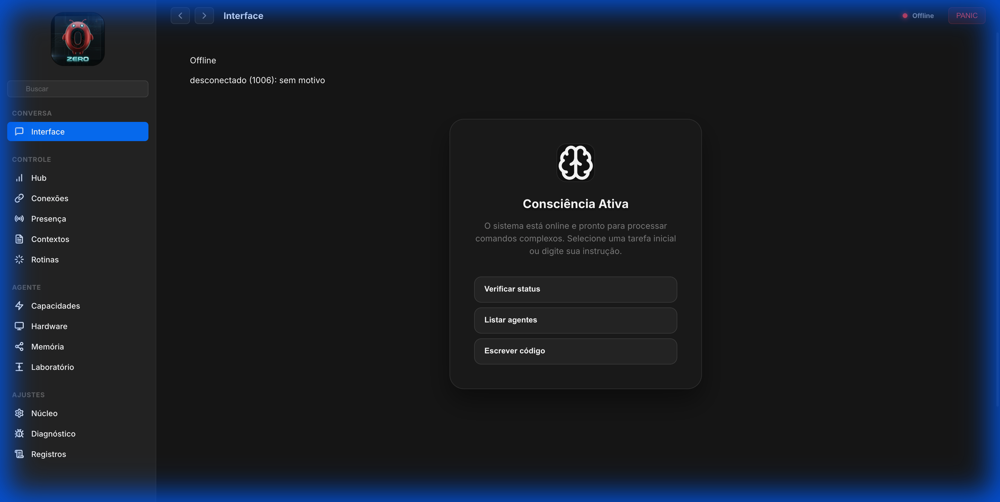
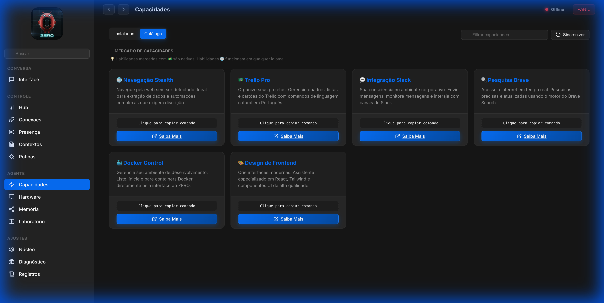
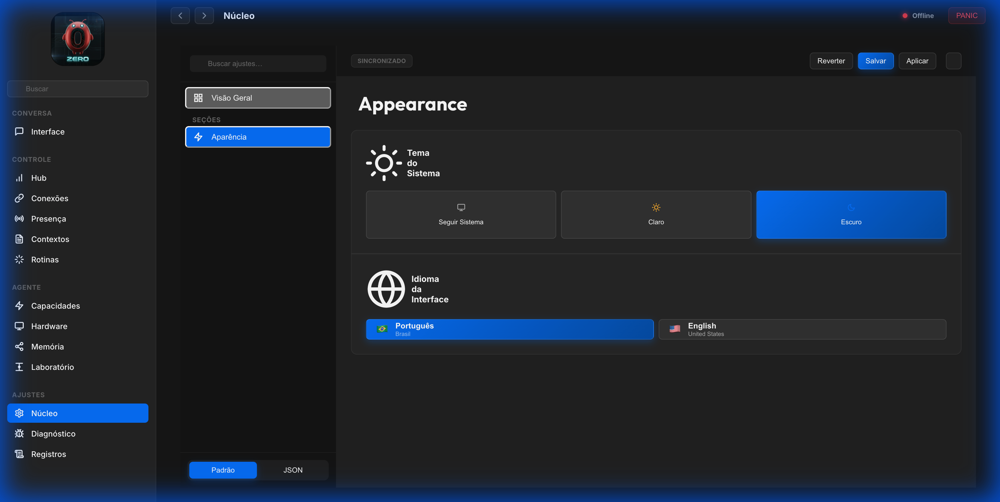

# ∅ ZERO — Sistema Operacional Pessoal Agêntico (A-POS)


> **"A infraestrutura invisível é a mais resiliente."** ∅

[](https://github.com/zero/zero/actions/workflows/ci.yml?branch=main)
[](LICENSE)
[](https://github.com/zero/zero)
[](CHANGELOG.md)

**ZERO** não é apenas uma distribuição de IA; é o ponto de singularidade onde a computação pessoal encontra a autonomia soberana. Projetado como um **Sistema Operacional de Agente (A-POS)**, o ZERO transforma sua máquina em uma fortaleza de inteligência local, eliminando a latência da nuvem e a vigilância corporativa.

[🇺🇸 English Version](README_EN.md)

---

## 🏛️ Filosofia e Princípios de Engenharia

O ecossistema ZERO é construído sobre quatro pilares fundamentais, validados por rigorosos padrões de arquitetura de software:

1. **Soberania Local-First (LLMs Locais)**: Todos os vetores de dados, modelos de pensamento e logs de auditoria residem no seu diretório `~/.zero`. Com suporte nativo a **Ollama** e execução de modelos como **Llama 3.2**, o ZERO garante sua autonomia mesmo sem conexão com a nuvem.
2. **Arquitetura Híbrida de Performance**: Um núcleo de performance crítica escrito em **Rust** (gerenciando VAD, telemetria de densidade e criptografia) integra-se perfeitamente com a flexibilidade do **TypeScript** para orquestração de canais.
3. **Segurança Zero Trust (Cripta de Auditoria)**: Cada ação agêntica é registrada em logs permanentes e cifrados. O acesso é governado por políticas de menor privilégio (RBAC) e pareamento de dispositivos via mDNS/Bonjour.
4. **Autonomia Agêntica Proativa**: Através do **Nudge Engine**, o sistema transcende a reatividade, antecipando necessidades baseadas em contexto e operando em loops de deliberação de alta fidelidade.

---

## 🎨 Galeria de Interface (Experiência Altair)

Visualize o **ZERO** em operação. Estes são registros reais da interface de controle unificada:

| Chat & Assistente (Interface Altair) | Catálogo de Habilidades (Marketplace) |
| :--- | :--- |
|  |  |
| *Modo Foco com comandos proativos e sugestões inteligentes.* | *Extensões prontas para expandir os poderes da sua IA.* |

| Configurações de Aparência e Idioma | Núcleo do Sistema (Config) |
| :--- | :--- |
|  |  |
| *Customização total: Temas dinâmicos e localização PT-BR nativa.* | *Controle granular de cada parâmetro do seu A-POS.* |

---

## 🚀 Guia de Início Rápido para Desenvolvedores

### 🛠️ Pré-requisitos

- **Runtime**: Node.js ≥ 22.x
- **Package Manager**: pnpm (recomendado)
- **Rust Toolchain**: Requerido para compilação nativa do `rust-core`.

#### 💻 Requisitos de Sistema (Hardware)

Para garantir estabilidade e performance:

- **🖥️ Desktop Local (Mac/Windows/Linux)**:
  - **Mínimo**: 8 GB RAM (O ZERO consome pouco, mas o OS e Browser exigem o restante).
  - **Recomendado**: 16 GB+ RAM (Para uso fluido com VS Code + Browser + ZERO).
- **🌐 Servidor / VPS (Cloud)**:
  - **Mínimo**: 1 vCPU, 1 GB RAM (com Swap), 20 GB SSD.
  - **Ideal**: 2 vCPUs, 2 GB+ RAM, 40 GB+ SSD.
  - **Elite**: 4 vCPUs, 4 GB+ RAM (Para automação de navegador e múltiplos agentes).

### �️ Instalação "One-Liner" (Simplificada)

Escolha o método que melhor se adapta ao seu ambiente:

#### 🖥️ Local (Mac/Linux/Windows WSL)

Ideal para desenvolvedores e uso diário no computador pessoal.

```bash
curl -fsSL https://raw.githubusercontent.com/Lex-1401/ZERO/main/quickstart.sh | bash
```

#### 🌐 VPS / Nuvem (Docker)

Ideal para manter o ZERO online 24/7 com isolamento total.

```bash
curl -fsSL https://raw.githubusercontent.com/Lex-1401/ZERO/main/deploy-docker.sh | bash
```

### 📦 Instalação do Workspace de Desenvolvimento (Manual)

   ```bash
   git clone https://github.com/zero/zero.git
   cd zero
   pnpm install
   ```

1. **Compilação de Subsistemas**:

   ```bash
   pnpm ui:build    # Compila a Interface Altair (Glassmorphism Control UI)
   pnpm build       # Compila o Núcleo TypeScript e Native Core
   ```

2. **Orquestração Inicial**:

   ```bash
   pnpm zero onboard --install-daemon
   ```

   *Isso iniciará o mago de configuração que preparará sua "Origem" (diretório Home), chaves de API e canais de mensageria.*

---

## 📂 Anatomia do Sistema (Developer Layout)

| Diretório | Responsabilidade Técnica |
| :--- | :--- |
| `src/gateway/` | **Medula Espinhal**: Servidor WebSocket RPC, roteamento e coordenação de nós. |
| `src/agents/` | **Córtex**: Lógica do Agente Pi, governança de prompt e Runners de LLM. |
| `rust-core/` | **Motor de Alta Densidade**: Telemetria, VAD e criptografia via NAPI-RS. |
| `src/channels/` | **Sentidos**: Adaptadores para WhatsApp, Telegram, Discord, Slack, iMessage. |
| `ui/` | **Plano de Controle**: Interface Altair desenvolvida com estética premium. |
| `skills/` | **Habilidades**: Extensões isoladas que expandem as capacidades cognitivas do sistema. |
| `src/realtime/` | **Percepção**: Motor multimodal de baixa latência (WebSocket) para streaming de áudio/vídeo e roteamento semântico. |

---

## 🛡️ Protocolo de Segurança e Sentinel

O módulo **Zero Sentinel** implementa defesas ativas contra ameaças vetoriais:

- **LLM Security Guardrails**: Detecção nativa de injeção de prompt via Chain-of-Thought (CoT).
- **Redação de PII**: Identificação e ocultação automática de informações sensíveis em tempo real.
- **Panic Protocol**: Interrupção imediata de todos os processos agênticos via `zero panic`.
- **Local LLM Sovereignty**: Integração otimizada com Ollama para modelos Llama 3.x e DeepSeek.

---

## 🤝 Contribuição e Vibração

Estamos construindo a infraestrutura do amanhã. Contribuições são bem-vindas de engenheiros que buscam a soberania tecnológica.

- **Padrões de Docstrings**: Seguimos o padrão JSDoc rigoroso para documentação técnica.
- **Pilha Moderna**: TS (Node 22), Rust (napi-rs), Vitest, Playwright.

Este repositório é um fork de <https://openclaw.ai/> adaptado por **Leandro Azevedo** para Brasileiros, incluindo funcionalidades e segurança.

---

*ZERO é uma ferramenta de precisão. Use-a com intenção.*
