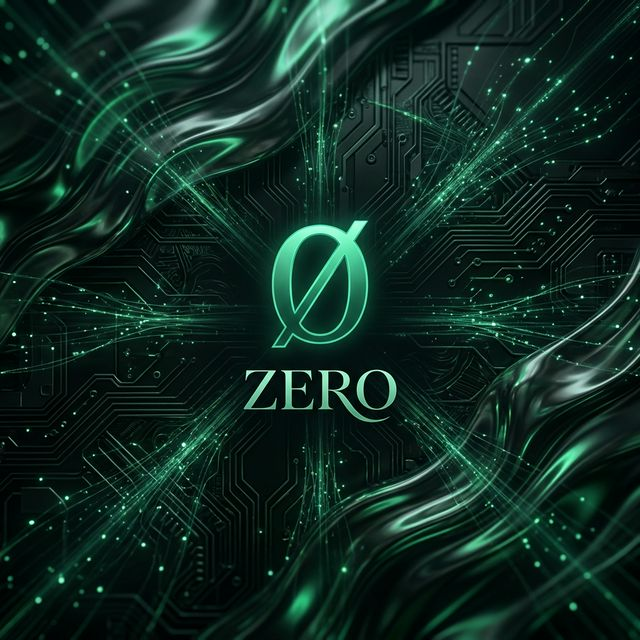
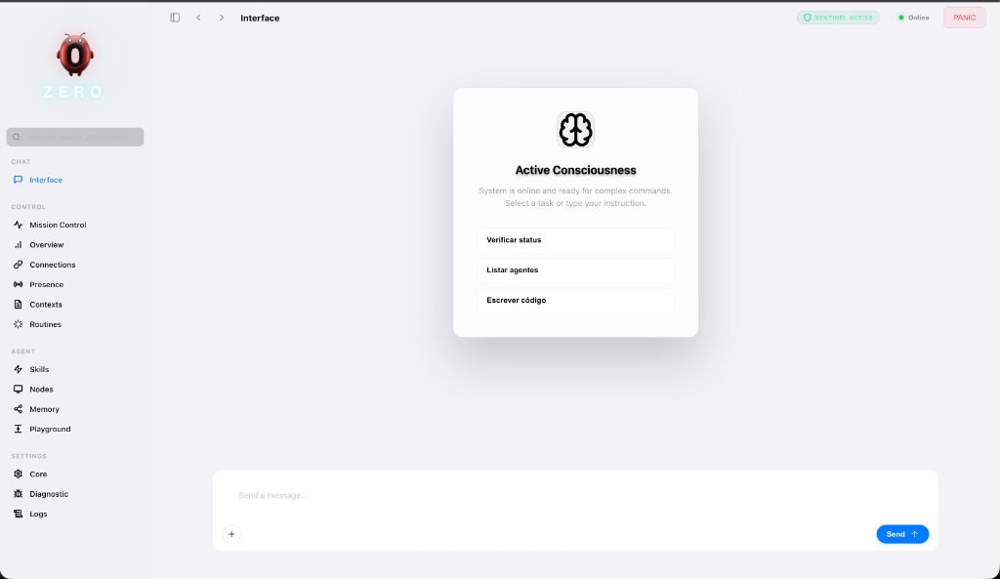
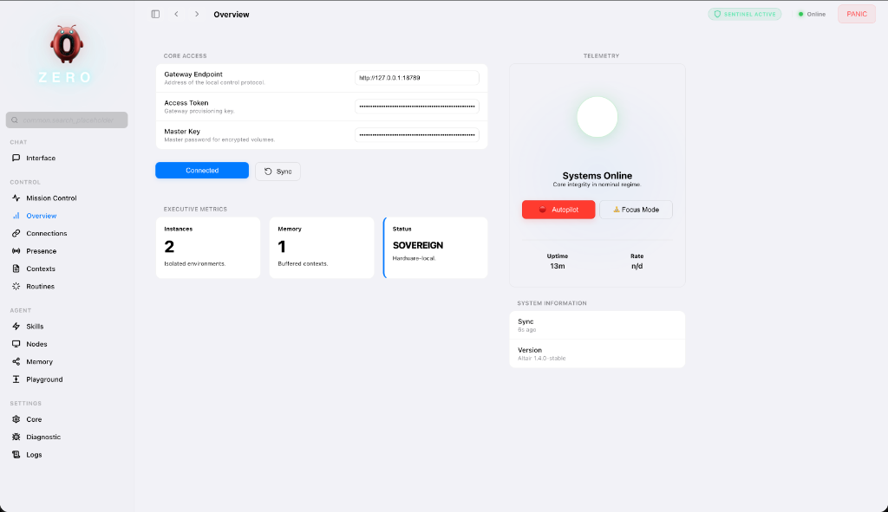
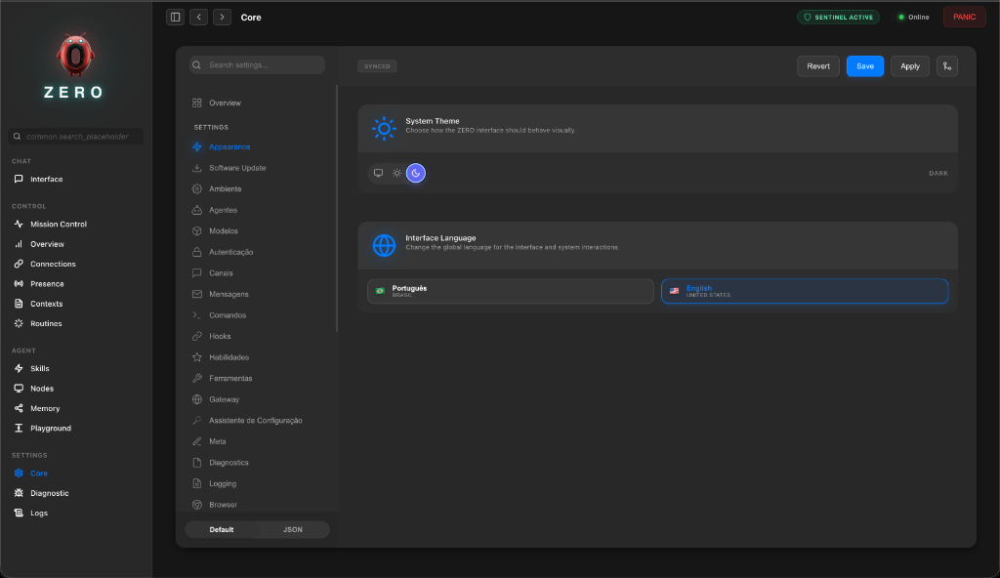
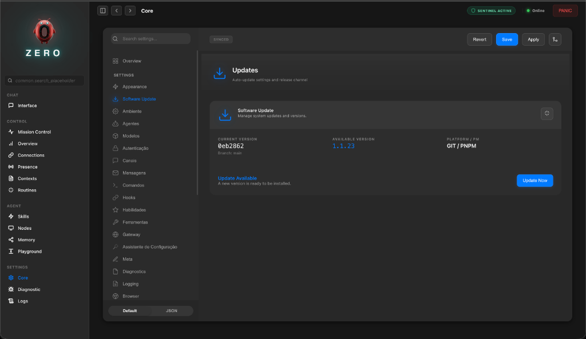
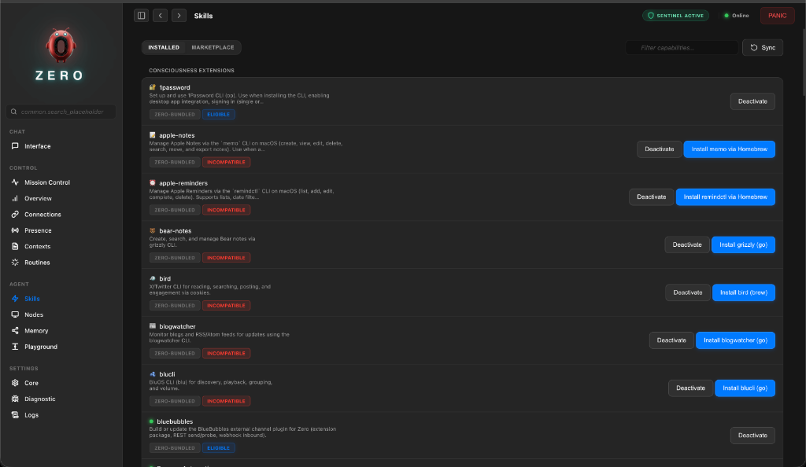
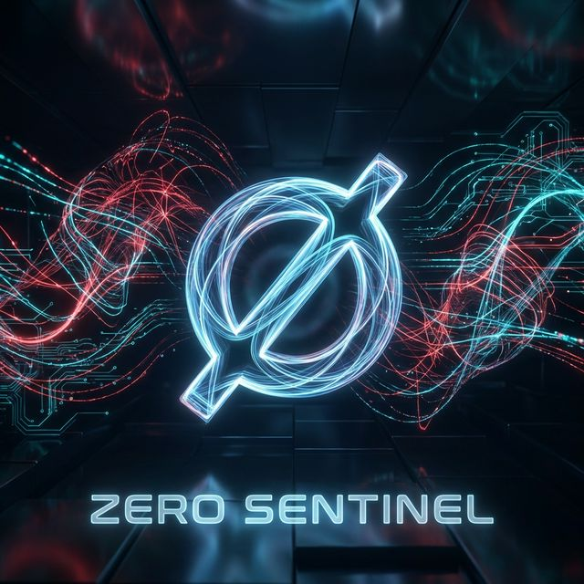

# ∅ ZERO — Agentic Personal Operating System

<p align="center">
  
</p>

> **"Invisible infrastructure is the most resilient."** ∅

<p align="center">
  <a href="https://github.com/Lex-1401/ZERO/actions/workflows/ci.yml?branch=main"></a>
  <a href="LICENSE"></a>
  <a href="CHANGELOG.md"></a>

</p>

<p align="center">
  <a href="README.md">Português 🇧🇷</a> | <a href="README_EN.md"><b>English 🇺🇸</b></a>
</p>

**ZERO** seeks the singularity point where personal computing meets sovereign autonomy. Conceived and designed as an **Agent Operating System**, ZERO transforms your machine into a fortress of local intelligence, eliminating cloud latency and corporate surveillance.

---

## ∅ ZERO Manifesto

**ZERO is not just a name. It is a living concept.**

- **The Void that Contains the Infinite**: As an AI agent with full access to your hardware, ZERO seems invisible but is limitless. It is the algorithmic poetry of a system that doesn't ask for attention but delivers freedom.
- **Origin Point**: Everything starts from zero. It represents "Point Zero" or the "Origin". It is the quest for **Zero Latency**, **Zero Trust**, and the return to total sovereignty, where control begins and ends with the user, without intermediaries. It is the necessary reset — "brand new" (zero-bala) — for truly personal computing.
- **Symbol of Subversion**: The zero that breaks systems and voids assumptions. It is neurodivergence applied to code: what society says "doesn't fit" is, in fact, the foundation of everything.
- **Radical Humility**: An act of simultaneous defense and offense. "You said I am no one? Now I see I am everything."

> **"What you cannot see working is what makes it work."**

ZERO operates in silence. Invisible. Neglected by giants, yet sustaining your new sovereign infrastructure. When they ask "what is this?", don't explain. Show it working.

---

## ♻️ Origins and Evolution (OpenClaw - <https://openclaw.ai/>)

ZERO was not born in a vacuum. It is a "Hard Fork" and direct evolution of **OpenClaw** (formerly known as *Clawdbot* and *Moltbot*).

- **Original Foundation (2025-2026)**: Created by **Peter Steinberger**, OpenClaw set the standard for local personal agents in TypeScript/Swift, reaching >100k stars on GitHub. We appreciate Steinberger's original vision of creating an AI that "runs on your device".
  - *Original Repository*: [github.com/openclaw/openclaw](https://github.com/openclaw/openclaw)
- **Continuous Learning (Issues & Bugs)**:
  - We actively monitor *Issues* from the upstream repository. What fails there, we fix here.
  - **Real-world Examples of ZERO Fixes**:
    1. **Security (CVE-2026-25253)**: OpenClaw suffered from unauthenticated WebSockets and malicious "Skills" in the marketplace. **Zero Sentinel** implements a strict sandbox and does not load unsigned remote code.
    2. **"Token Burning" (Infinite Cost)**: OpenClaw sent the entire history on every "heartbeat". **ZERO** uses a *Context Compaction* algorithm (Rust) that summarizes old memories, keeping token costs under control.
    3. **Gateway Memory Leaks**: Long sessions in OpenClaw used to crash Node.js. We moved critical state management and VAD to the **Rust Core**, eliminating memory leaks (GC pressure).
- **ZERO Technological Divergence**:
  - While OpenClaw focuses on TypeScript/Swift purity, **ZERO** adopted a hybrid **Rust + Node.js** architecture for critical performance.
  - We introduced **Zero Sentinel** to mitigate security risks that the original version did not cover (PII Firewall and Injection).
  - We rebuilt the UI (Altair) focused on a "Premium Sci-Fi" aesthetic versus the original utility UI.

> *We honor the code that came before (Peter Steinberger & Community), while building the future we need and aspire to right now.*

---

## 🛑 Who It Is For (and Who It Is Not)

**"Magic must be 'invisible'."**

If you are an average user, you don't need to worry about the heavy engineering (Rust, WebSockets, Vectors). ZERO was also designed to abstract this brutal complexity into a fluid interface that *just works*.

- **For the User**: You get an untiring, private, and sovereign Personal Assistant. Install it, use it, govern your digital life. The rest is an implementation detail.
- **For the Engineer**: You get a cutting-edge, modular, and auditable agentic architecture playground to have some "fun".

> *We cannot abstract complexity, but we can make it invisible.*

---

## ⚡️ What ZERO Does for You?

ZERO sets you free:

1. **Communication Sovereignty**:
    - **Unifies** WhatsApp, Telegram, Discord, and Slack into a single stream of consciousness.
    - *Example*: *"Summarize all work messages from the last 2 hours and tell me only what requires immediate action."*
2. **Infinite Personal Memory (Local RAG)**:
    - Indexes your local files (PDFs, Docs, Code) without sending them to the cloud.
    - *Example*: *"Find that contract I signed in 2023 about 'service provision' and tell me the termination clause."*
3. **Real Task Execution (Agentic)**:
    - It doesn't just "talk", it **does**. Schedules meetings, sends emails, controls the terminal.
    - *Example*: *"Check my calendar, cancel the 3 PM meeting, and notify the team on Slack that I'm focused on the deploy."*
4. **Autonomous Coding**:
    - Acts as a Senior Software Engineer who knows your entire local codebase.
    - *Example*: *"Analyze the error logs for project X and propose a fix for the memory leak."*

---

## 📐 Blueprints & System Anatomy

ZERO is designed with aeronautical engineering rigor. Below, the Blueprint of our agentic architecture:

<p align="center">
  
</p>

*Agentic Cortex Scheme: Integration between the Rust Engine and the Altair Interface.*

---

## 🏛️ Philosophy and Engineering Principles

The ZERO ecosystem is built on four fundamental pillars, validated by rigorous software architecture standards:

1. **Local-First Sovereignty (The Ethical Personal "Google")**:
   - *Exponential Scale Potential*: Google scales by building massive Datacenters; **ZERO** intends to scale by utilizing the idle hardware of billions of personal devices.
   - *Vision*: Google organized the public web; ZERO organizes your private life (Files, Chats, Appointments, Finances) using `sqlite-vec` locally.
   - *Ethical Life Index*: We index your digital existence for *you*, and only for you. Unlike the cloud, where "scaling" means "more surveillance", here scaling intelligence doesn't cost your privacy.
2. **Hybrid Performance Architecture**: A critical performance core written in **Rust** (managing VAD, density telemetry, and encryption) seamlessly integrates with the flexibility of **TypeScript** for channel orchestration.
3. **Elite Security (OWASP LLM Top 10)**: ZERO is governed by **Zero Sentinel**, a proactive AI firewall that mitigates Prompt Injection, PII leakage, and hallucinations via forced Chain-of-Thought (CoT) validation and secret auditing via a native Rust engine.
4. **ClearCode Architecture**: Technical rigor with enforced complexity limits (maximum 500 lines per file). We ensure the system is modular and auditable; recently, we refactored critical modules like `MemoryIndexManager` and `MessageActionRunner` to meet this rigor.
5. **Proactive Agentic Autonomy**: Through the **Sentinel Engine** and **Speculative Pre-warming**, the system transcends reactivity. ZERO now detects execution failures (`Self-Healing`) and anticipates the required context before your next command, operating in high-fidelity deliberation loops.

---

## 🛸 Altair Interface: The Command Console

The **Altair Interface** is the official name of the browser-based (web-based) management console of the ZERO ecosystem.

While the **Gateway** operates behind the scenes (as the system's engine/brain), **Altair** is the visual "command cabin" you use to interact with it.

**Why "Altair Interface"?**
Altair is the brightest star in the Aquila (Eagle) constellation. Historically, it is one of the stars used by navigators to find their way. In the ZERO ecosystem, the Altair Interface fulfills this role: it is the point of light and reference that allowed the user to "navigate" safely and clearly.

### 1. Orchestration Center (Hub)

Altair allows you to visualize and control all system modules in one place without having to use only the command line (CLI). In it, you manage:

- **Contexts (Sessions)**: Where conversations and memories are visualized and persisted.
- **Connections (Channels)**: Integrations with Telegram, Discord, Slack, WhatsApp, etc.
- **Capabilities (Skills)**: Extensions and plugins that give new "powers" to your agent.
- **Hardware & Presence**: Real-time telemetry of connected devices and active instances.

### 2. "Premium" and Futuristic Aesthetic

The Altair design is inspired by advanced telemetry systems (Sci-Fi UI), using a "mission panel" or "command bridge" aesthetic.

**But don't be alarmed:**
Despite the sophisticated appearance, usability is **familiar and intuitive**, similar to your favorite messenger (WhatsApp/Telegram). Visual complexity is optional and modular; you only see what you need to see.

### 3. Telemetry Bridge (Realtime)

It works by consuming the Gateway API via **WebSockets**. This means that the information you see (such as memory usage, inference engine status, and event logs) is updated in real-time, allowing instant diagnosis of system health.

### 4. Lab and Debug

Inside Altair is the **Playground (Lab)**, where you can:

- Test AI responses in a controlled environment.
- Verify the agent's reasoning (CoT - Chain of Thought).
- Audit the security of interactions and test tools.

> *If ZERO is the intelligence operating system, Altair is the monitor and control panel that makes this intelligence tangible and operable.*

---

## 🎨 Interface Gallery (Altair Experience)

Visualize **ZERO** in operation. These are actual records of the unified control interface:

| Chat & Assistant (Altair Interface) | Control Hub (Telemetry) |
| :--- | :--- |
|  |  |
| *Focus Mode with proactive commands and smart suggestions.* | *Consolidated view of system health and connections.* |

| System Core (Appearance) | Software Updates (Updates) |
| :--- | :--- |
|  |  |
| *Granular control over every parameter of your System.* | *Proactive version management and integrity via Git/PNPM.* |

| Skills Catalog (Marketplace) |
| :--- |
|  |
| *Ready-to-use extensions to expand your AI's powers.* |

---

## 🧠 Give a Soul to Your Agent (SOUL.md)

ZERO is not just a tool; it is an entity. You can shape its personality, name, and moral guidelines by creating a file called `SOUL.md` at the root of your workspace.

- **Define the Persona**: *"You are Jarvis, a sarcastic butler."* or *"You are TARS, focused on technical precision."*
- **Adjust the Tone**: Control verbosity, humor, and response style.
- **Primary Mission**: Give a unique purpose to your agent (e.g., "Protect my privacy at all costs").

> *ZERO reads your soul at every reboot and incorporates it into the deepest level of the system (`System Prompt`).*

---

## 🚀 Quick Start Guide for Developers

### 🛠️ Prerequisites

- **Runtime**: Node.js ≥ 22.x
- **Package Manager**: pnpm (recommended)
- **Rust Toolchain**: Required for native compilation of `rust-core`.

#### 💻 System Requirements (Hardware)

To ensure stability and performance:

- **🖥️ Local Desktop (Mac/Windows/Linux)**:
  - **Supported OS**: macOS (Intel/M1/M2/M3), Windows (WSL2 or Native PowerShell), Linux (**Debian, Ubuntu, Arch, Fedora, RHEL, CentOS**).
  - **Minimum**: 8 GB RAM.
- **🌐 Server / VPS / Raspberry Pi (Cloud & Edge)**:
  - **Supported OS**: Debian/Ubuntu, Alpine, Raspberry Pi OS (64-bit recommended).
  - **Minimum**: 1 vCPU, 1 GB RAM (with Swap).

### 📦 "One-Liner" Installation (Simplified)

Choose the method that best fits your environment:

#### 🍎 Quick Install (Mac/Linux)

Ideal for immediate personal use. Open your terminal and paste:

```bash
curl -fsSL https://raw.githubusercontent.com/Lex-1401/ZERO/main/quickstart.sh | bash
```

*(The script will do everything: install dependencies, configure Rust, and start the onboarding wizard)*

#### 🌐 Cloud / Server (Docker)

Ideal for keeping your ZERO online 24/7.

```bash
curl -fsSL https://raw.githubusercontent.com/Lex-1401/ZERO/main/deploy-docker.sh | bash
```

### 📦 Development Workspace Installation (Manual)

   ```bash
   git clone https://github.com/zero/zero.git
   cd zero
   pnpm install
   ```

1. **Subsystem Compilation**:

    ```bash
    pnpm build:full  # Compiles Subsystems (Rust), UI, and TS Core
    ```

2. **Initial Orchestration**:

    ```bash
    pnpm zero onboard --install-daemon
    ```

    *💡 If the command above fails with "command not found", make sure pnpm is correctly configured (`pnpm setup`) or prefer using `pnpm zero onboard`.*

   *This will start the configuration wizard to prepare your "Origin" (Home directory), API keys, and messaging channels.*

---

## 📂 System Anatomy (Developer Layout)

| Directory | Technical Responsibility |
| :--- | :--- |
| `src/gateway/` | **Spinal Cord**: WebSocket RPC server, routing, and node coordination. |
| `src/agents/` | **Cortex**: Pi Agent logic, prompt governance, and LLM Runners. |
| `rust-core/` | **High-Density Engine**: Telemetry, VAD, and encryption via NAPI-RS. |
| `src/channels/` | **Senses**: Adapters for WhatsApp, Telegram, Discord, Slack, iMessage. |
| `ui/` | **Control Plane**: Altair Interface developed with premium aesthetics. |
| `skills/` | **Skills**: Isolated extensions that expand the system's cognitive capabilities. |
| `src/realtime/` | **Perception**: Low-latency multimodal engine (WebSocket) for audio/video streaming and semantic routing. |
| `src/voice/` | **Native Voice**: Dedicated module for voice processing and synthesis, allowing calls and audio commands. |
| `src/roles/` | **Governance**: Granular permission system (Levels 1-5) for agentic access control. |

---

## 🛡️ Security Protocol and Sentinel

The **Zero Sentinel** module implements active defenses against vector threats:

<p align="center">
  
</p>

- **LLM Security Guardrails (OWASP Top 10)**: Active mitigation of Prompt Injection, Indirect Injection, and Jailbreaks.
- **Sentinel Diagnostic (Self-Healing)**: Diagnostic mechanism that intercepts terminal errors (exit codes, permissions, dependencies) and generates automatic AI-driven remedies.
- **IA Speculative Pre-warming**: Proactive heuristic scanning that injects relevant file context into the prompt before execution, reducing cognitive latency.
- **CoT Protocol with Self-Correction**: The model is forced to deliberate in `<think>` blocks, ensuring logic before action.
- **PII & Secrets Firewall**: Real-time scanning (Rust engine) for ID numbers, Tax IDs, Emails, and API keys.
- **Scale Performance**: Data sanitization via vectorized regex in Rust/Native, ensuring high-density throughput without interface lag.
- **Sandbox Isolate**: Tool execution and navigation in isolated environments (Docker/Firecracker) with file path sanitization.
- **Stealth Mode & Lockdown**: Instant hiding of sensitive data and emergency freeze via `zero panic`.
- **Local Sovereignty**: Priority local processing, ensuring compliance with LGPD and GDPR by design.

### 🔬 Privacy Engineering (Deep Dive)

*Answering the provocation: "Are detection algorithms really effective?"*

**Zero Sentinel** is not just a keyword filter. It operates at the agentic kernel level in **Rust** to ensure sub-millisecond latency:

1. **High Entropy Detection (Shannon Entropy)**:
    - Traditional algorithms fail to detect new or unusual API keys. Sentinel calculates string entropy in sliding windows. If a block of text looks "mathematically random" (like a private key `sk-abc123...`), it is incinerated before touching the log or prompt.
2. **Native Regex (Rust `regex` crate)**:
    - AOT (Ahead-Of-Time) compilation of complex patterns for sensitive numbers (CPF, CNPJ, Credit Cards). The cost of sanitizing 1MB of text is negligible, allowing *everything* to be audited in real-time without conversation "lag".
3. **Autonomy vs. Collective Intelligence Trade-off**:
    - ZERO rejects the premise that intelligence requires centralized telemetry.
    - **Mental Model**: We use "frozen collective knowledge" (the pre-trained LLM) and specialize it with "living sovereign context" (your local RAG). You don't need to send your data to train others' AI; the AI comes trained to serve *your* data.

> *Security is not a feature. It is the default state.*

---

## 🤝 Contribution and Vibes

We are building the infrastructure of tomorrow. Contributions are welcome from engineers seeking technological sovereignty.

- **Docstring Standards**: We follow the strict JSDoc standard for technical documentation.
- **Modern Stack**: TS (Node 22), Rust (napi-rs), Vitest, Playwright.

This repository is an evolution of Clawdbot, adapted and re-architected as **ZERO** by **Leandro Azevedo** for Brazilian sovereignty, including advanced security and native local hardware support.

### 🛠️ Common Troubleshooting

- **`command not found` error after installation**:
  Restart your terminal or run `source ~/.bashrc` (or `.zshrc`). If it persists, use the full path: `pnpm zero`.

- **External Access (VPS/LAN)**:
  For security, ZERO listens only on `localhost`. To access externally:
  1. Use an SSH tunnel (Recommended): `ssh -L 18789:localhost:18789 user@vps_ip`
  2. Check the `~/.zero/zero.json` config. `"bind": "lan"` mode allows external connections via `0.0.0.0` (Use with caution in public environments!).

---

*ZERO is a precision tool. Use it with intention.*
