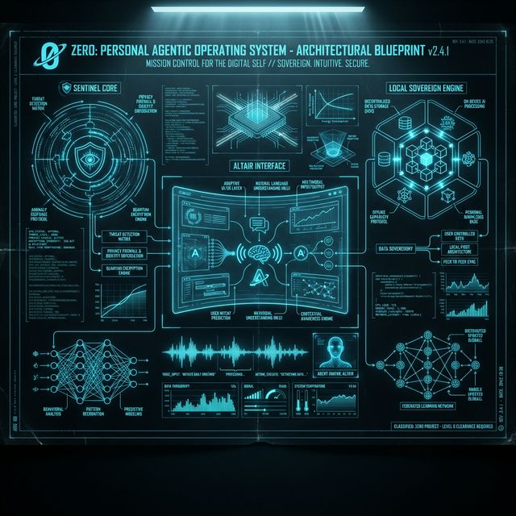
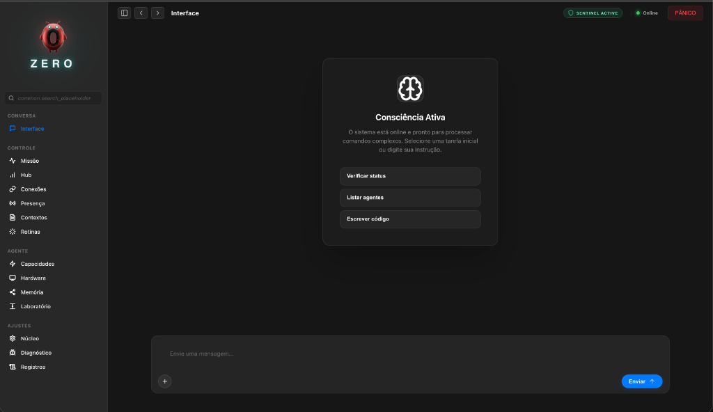
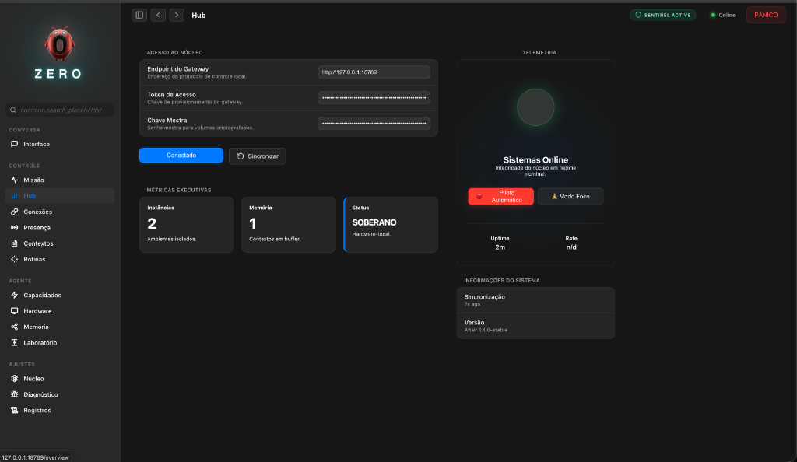
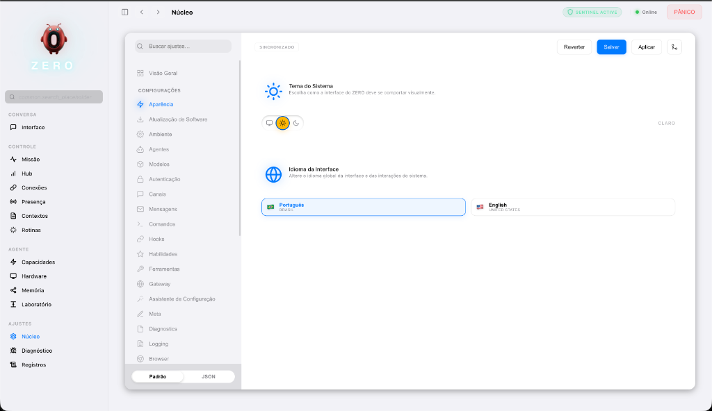
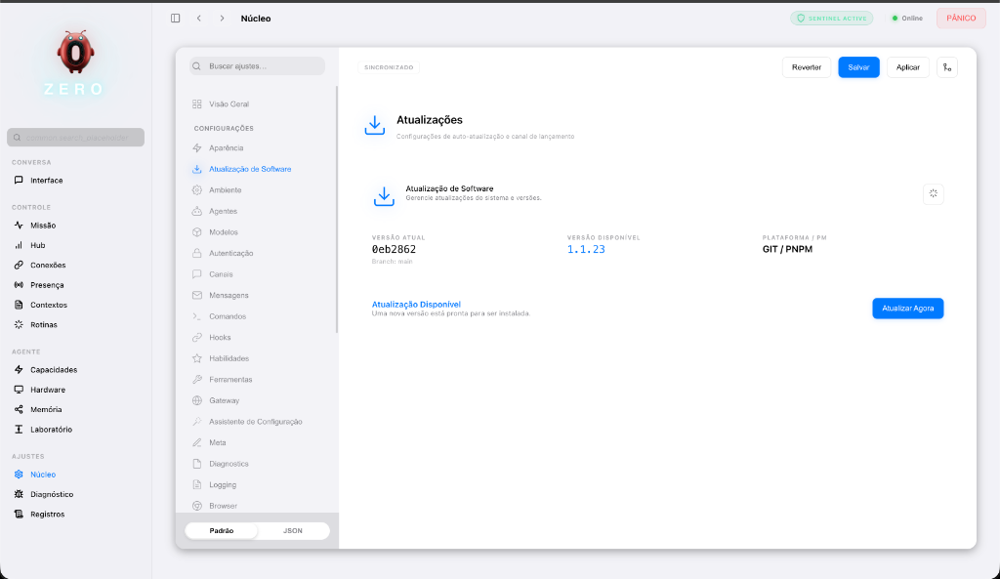
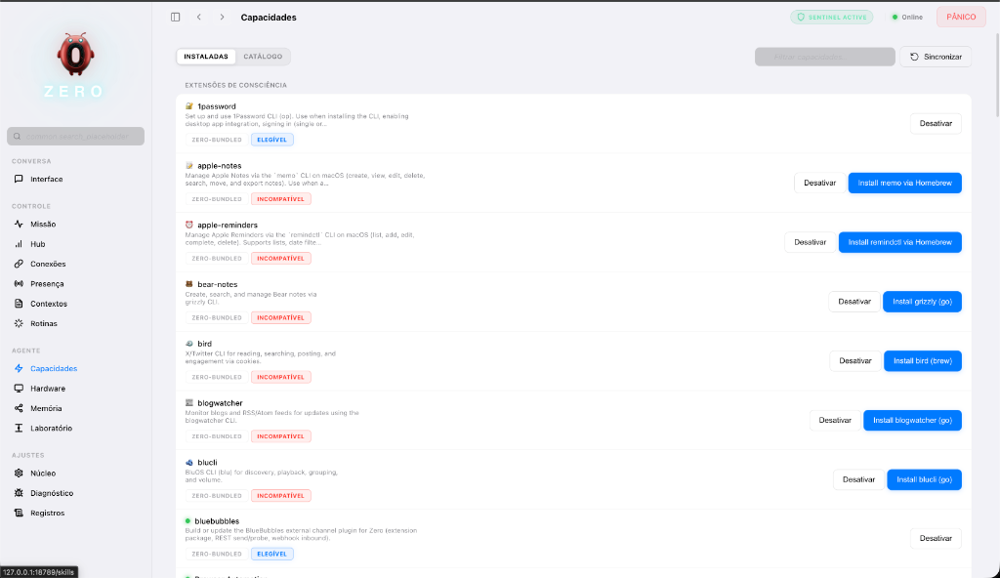
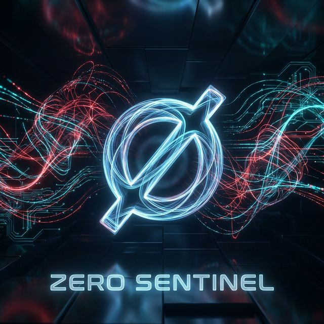

# ∅ ZERO — Sistema Operativo Personal Agéntico

> **"La infraestructura invisible es la más resiliente."** ∅

[](https://github.com/Lex-1401/ZERO/actions/workflows/ci.yml?branch=main)
[](LICENSE)
[](CHANGELOG.md)

[Português 🇧🇷](README.md) | [English 🇺🇸](README_EN.md) | [**Español 🇪🇸**](README_ES.md)

**ZERO** busca el punto de singularidad donde la computación personal se encuentra con la autonomía soberana. Concebido y diseñado como un **Sistema Operativo de Agentes (A-POS)**, ZERO transforma su máquina en una fortaleza de inteligencia local, eliminando la latencia de la nube y la vigilancia corporativa.

---

## ⛩️ Arquitectura A-POS (Agentic Operating System)

ZERO opera bajo el concepto de **Agentic Operating System**, una arquitectura donde el sistema no solo obedece comandos, sino que interactúa con el entorno y evoluciona de forma autónoma.

1. **Auto-Evolución Soberana**: Capacidad del sistema para auto-repararse y auto-codificarse localmente. Vea el [Manifiesto de Auto-Evolución](docs/SELF_EVOLUTION.md).

## 🏛️ Ingeniería de Alto Rendimiento

ZERO ahora opera bajo estándares de arquitectura avanzados, elevando la estabilidad y la seguridad del sistema.

1. **Sentinel Engine (Seguridad Avanzada)**:
   - Delegación total al **Rust Core** (`ratchet`) para inspección de seguridad en submiliseisgundos.
   - **Análisis de Entropia de Shannon** para detectar secretos ofuscados y claves criptográficas.
   - Defensa contra Homóglifos mediante normalización Unicode NFKC.
2. **Quantum Altair UI**:
   - Estética **Glassmorphism** de alta fidelidad (desenfoque de 40px, saturación de 180%).
   - Tipografía técnica **JetBrains Mono** para máxima legibilidad de datos.
   - Fondo dinámico `mesh-drift` que reacciona a la luz y al contexto.
3. **Observabilidad y Telemetría**:
   - Broadcast de métricas de rendimiento (tokens/s y latencia) vía WebSocket en tiempo real.
   - Monitoreo continuo de la integridad del sistema.
4. **Onboarding & Diagnóstico**:
   - **Guided Welcome Tour**: Un flujo interactivo de bienvenida que presenta el cockpit de ZERO a los nuevos usuarios.
   - **Grouping & Diagnostics**: Organización automática de Skills por compatibilidad con diagnósticos en tiempo real de dependencias (OS, Binarios, Env).
5. **Evolución Arquitectural v0.2.0**:
   - **Traits System**: Abstracción de núcleos (`Provider`/`Channel`) vía Rust Traits para modularidad extrema.
   - **Native Heartbeat**: Orquestación de tareas críticas en Rust para latencia cero.
   - **AIEOS Vault**: Contenedorización de identidad de agente para portabilidad total.
   - **Kernel-Only Mode**: Ejecución ultra ligera (`--kernel-only`) para servidores y background.
6. **Modelos de Élite & Ultra-Velocidad (Feb 2026)**:
   - Soporte nativo para la vanguardia: **Gemini 3.1 Pro**, **Claude 4.6**, **Grok 4.20**, **GPT-5.3** y **Tiny Aya**.
   - Integración con **Groq**, **Cerebras** y **Modal Labs** (GLM-5 FP8) para latencia casi cero.

---

## ∅ Manifiesto ZERO

**ZERO no es solo un nombre. Es un concepto vivo.**

- **El Vacío que Contiene el Infinito**: Como un agente de IA con acceso total a su hardware, ZERO parece invisible, pero es ilimitado. Es la poesía algorítmica de un sistema que no pide atención, sino que entrega libertad.
- **Punto de Origen**: Todo comienza desde cero. Representa el "Punto Cero" o el "Origen". Es la búsqueda de **Latencia Cero**, **Zero Trust** (Confianza Cero) y el retorno a la soberanía total, donde el control comienza y termina en el usuario, sin intermediarios. Es el reset necesario — "borrón y cuenta nueva" — para una computación verdaderamente personal.
- **Símbolo de Subversión**: El cero que rompe sistemas y anula supuestos. Es la neurodivergencia aplicada al código: lo que la sociedad dice que "no encaja" es, de hecho, la base de todo.
- **Humildade Radical**: Un acto de defensa y ataque simultáneos. "¿Dijiste que no soy nadie? Ahora veo que lo soy todo."

> **"Lo que no ves funcionando es lo que hace que funcione."**

ZERO opera en silencio. Invisible. Descuidado por los gigantes, pero sosteniendo su nueva infraestructura soberana. Cuando pregunten "¿qué es esto?", no explique. Muéstrelo funcionando.

---

### 🦊 Identidad Visual: El Lobo de Turing

El logo de **ZERO** — una fusión de la letra **"Z"** con un **Lobo/Zorro Cibernético** — representa la esencia de la inteligencia agéntica:

- **Instinto y Agilidad**: Como un lobo, el sistema tiene instintos agudos para navegar por su sistema de archivos y actuar con precisión quirúrgica.
- **Soberanía Solitaria**: El lobo es un símbolo de independencia. ZERO opera localmente, sin depender de "manadas" de servidores de terceros para procesar su mente.
- **Fusión Hombre-Máquina**: La estructura metálica con circuitos cian pulsantes simboliza la armonía entre el diseño humano y el poder computacional bruto. Es la tecnología sirviendo a la vida, no al revés.

---

## ♻️ Orígenes y Evolución (OpenClaw - <https://openclaw.ai/>)

ZERO no nació en el vacío. Es un "Hard Fork" y evolución directa de **OpenClaw** (anteriormente conocido como _Clawdbot_ y _Moltbot_).

- **Fundación Original (2025-2026)**: Creado por **Peter Steinberger**, OpenClaw estableció el estándar para agentes personales locales en TypeScript/Swift, alcanzando >100k estrellas en GitHub. Agradecemos la visión original de Steinberger de crear una IA que "corre en su dispositivo".
  - _Repositorio Original_: [github.com/openclaw/openclaw](https://github.com/openclaw/openclaw)
- **Aprendizaje Continuo (Issues & Bugs)**:
  - Monitoreamos activamente las _Issues_ del repositorio upstream. Lo que falla allá, lo corregimos aquí.
  - **Ejemplos Reales de Correcciones ZERO**: 1. **Seguridad (CVE-2026-25253)**: OpenClaw sufría con WebSockets no autenticados y "Skills" maliciosas en el marketplace. **Zero Sentinel** implementa un sandbox rigoroso y no carga código remoto no firmado. 2. **"Quema de Tokens" (Costo Infinito)**: OpenClaw enviaba todo el historial en cada "heartbeat". **ZERO** utiliza un algoritmo de _Context Compaction_ (Rust) que resume memorias antiguas, manteniendo los costos de tokens bajo control. 3. **Fugas de Memoria en el Gateway**: Sesiones largas en OpenClaw solían colgar el Node.js. Movimos la gestión de estado crítico y VAD al **Rust Core**, eliminando fugas de memoria (presión de GC).
- **Divergencia Tecnológica ZERO**:
  - Mientras OpenClaw se enfoca en la pureza de TypeScript/Swift, **ZERO** adoptó una arquitectura híbrida **Rust + Node.js** para un rendimiento crítico.
  - Introdujimos **Zero Sentinel** para mitigar riesgos de seguridad que la versión original no cubría (Firewall de PII e Inyección).
  - Reconstruimos la interfaz (Altair) enfocada en una estética "Premium Sci-Fi" frente a la UI utilitaria original.

> _Honramos el código que vino antes (Peter Steinberger & Comunidad), mientras construimos el futuro que necesitamos y aspiramos ahora._

---

## 🛑 Para Quién es (y Para Quién No é)

### "La magia debe ser 'invisible'."

Si usted es un usuario común, no necesita preocuparse por la ingeniería pesada (Rust, WebSockets, Vectors). ZERO fue diseñado para abstraer esta complejidad brutal en una interfaz fluida que _simplemente funciona_.

- **Para el Usuario**: Usted gana un Asistente Personal incansable, privado y soberano. Instale, use, gobierne su vida digital. El resto es detalle de implementación.
- **Para el Ingeniero**: Usted gana un playground de arquitectura agéntica de punta, modular y transparente para divertirse.

> _No podemos abstraer la complejidad, pero podemos hacerla invisible._

---

## ⚡️ ¿Qué hace ZERO por usted?

ZERO lo libera:

1. **Soberanía de Comunicación**:
   - **Unifica** WhatsApp, Telegram, Discord y Slack en un único flujo de conciencia.
   - _Ejemplo_: _"Resuma todos los mensajes de trabajo de las últimas 2 horas y dígame solo lo que requiere acción inmediata."_
2. **Memoria Personal Infinita (Local RAG)**:
   - Indexa sus archivos locales (PDFs, Docs, Código) sin enviarlos a la nube.
   - _Ejemplo_: _"Encuentre aquel contrato que firmé en 2023 sobre 'prestación de servicios' y dígame la cláusula de rescisión."_
3. **Ejecución Real de Tareas (Agéntico)**:
   - Él no solo "habla", él **hace**. Agenda reuniones, envía correos, controla la terminal.
   - _Ejemplo_: _"Verifique mi calendario, cancele la reunión de las 3 PM y avise al equipo en Slack que estoy enfocado en el despliegue."_
4. **Coding Autónomo**:
   - Actúa como un Ingeniero de Software Senior que conoce todo su codebase local.
   - _Ejemplo_: _"Analice los logs de error del proyecto X y proponga una corrección para el memory leak."_

---

## 📐 Blueprints y Anatomía del Sistema

ZERO está diseñado con rigor de ingeniería aeronáutica. A continuación, el Blueprint de nuestra arquitectura agéntica:



_Esquema del Córtex Agéntico: Integración entre la Rust Engine y la Interfaz Altair._

---

## 🏛️ Filosofía y Principios de Ingeniería

El ecosistema ZERO está construido sobre cuatro pilares fundamentales, validados por estándares rigurosos de arquitectura de software:

1. **Soberanía Local-First (El "Google" Personal Ético)**:
   - _Potencial de Escala Exponencial_: Google escala construyendo Datacenters masivos; **ZERO** pretende escalar utilizando el hardware ocioso de miles de millones de dispositivos personales.
   - _Visión_: Google organizó la web pública; ZERO organiza su vida privada (Archivos, Chats, Compromisos, Finanzas) usando `sqlite-vec` localmente.
   - _Índice de Vida Ético_: Indexamos su existencia digital para _usted_, y solo para usted. A diferencia de la nube, donde "escalar" significa "más vigilancia", aquí escalar la inteligencia no cuesta su privacidad.
2. **Arquitectura de Rendimiento Híbrida**: Un núcleo de rendimiento crítico escrito en **Rust** (gestionando VAD, telemetría de densidad y cifrado) se integra perfectamente con la flexibilidad de **TypeScript** para la orquestación de canales.
3. **Seguridad de Élite (OWASP LLM Top 10)**: ZERO es gobernado por el **Zero Sentinel**, un firewall de IA proactivo que mitiga la Inyección de Prompt, fuga de PII y alucinaciones vía validación forzada de Chain-of-Thought (CoT) y verificación de secretos mediante un motor nativo Rust.
4. **Arquitectura ClearCode**: Rigor técnico con límites de complejidad impuestos (máximo de 500 líneas por archivo). Garantizamos que el sistema sea modular y robusto; recientemente, refactorizamos módulos críticos como `MemoryIndexManager` y `MessageActionRunner` para cumplir con este rigor.
5. **Autonomía Agéntica Proactiva**: A través del **Sentinel Engine** y del **Speculative Pre-warming**, el sistema trasciende la reactividad. ZERO ahora detecta fallos de ejecución (`Self-Healing`) y anticipa el contexto necesario antes de su próximo comando, operando en bucles de deliberación de alta fidelidad.

---

## 🛸 Interfaz Altair: La Consola de Mando

La **Interfaz Altair** es el nombre oficial de la consola de gestión basada en navegador (web-based) del ecosistema ZERO.

Mientras que el **Gateway** opera tras bambalinas (como el motor/cerebro del sistema), **Altair** es la "cabina de mando" visual que usted usa para interactuar con él.

**¿Por qué "Interfaz Altair"?**
Altair es la estrella más brillante de la constelación de Aquila (Águila). Históricamente, es una de las estrellas usadas por navegadores para encontrar el camino. En el ecosistema ZERO, la Interfaz Altair cumple ese papel: es el punto de luz y referencia que permite al usuario "navegar" con seguridad y claridad.

### 1. Centro de Orquestación (Hub)

Altair permite visualizar y controlar todos los módulos del sistema en un solo lugar, sin necesidad de usar únicamente la línea de comandos (CLI). En ella, gestionará:

- **Contextos (Sesiones)**: Donde las conversaciones y memorias se visualizan y se persisten.
- **Conexiones (Canales)**: Integraciones con Telegram, Discord, Slack, WhatsApp, etc.
- **Capacidades (Skills)**: Extensiones y complementos que dan nuevos "poderes" a su agente.
- **Hardware y Presencia**: Telemetría en tiempo real de los dispositivos conectados e instancias activas.

### 2. Estética "Premium" y Futurista

El diseño de Altair se inspira en sistemas de telemetría avanzada (Sci-Fi UI), utilizando una estética de "panel de misión" o "puente de mando".

**Pero no se asuste:**
A pesar de la apariencia sofisticada, la usabilidad es **familiar e intuitiva**, similar a su mensajero favorito (WhatsApp/Telegram). La complejidad visual es opcional y modular; usted ve solo lo que necesita ver.

### 3. Puente de Telemetría (Realtime)

Funciona consumiendo la API del Gateway a través de **WebSockets**. Esto significa que la información que ve (como el uso de memoria, el estado del motor de inferencia y los logs de eventos) se desarrolla en tiempo real, permitiendo un diagnóstico instantáneo de la salud del sistema.

### 4. Laboratorio y Debug

Dentro de Altair existe el **Playground (Lab)**, donde puede:

- Probar respuestas de la IA en un entorno controlado.
- Verificar el razonamiento del agente (CoT - Chain of Thought).
- Auditar la seguridad de las interacciones y probar herramientas (tools).

> _Si ZERO es el sistema operativo de inteligencia, Altair es el monitor y panel de control que hace que esta inteligencia sea tangible y operable._

---

## 🎨 Galería de Interfaz (Altair Experience)

Visualice el **ZERO** en operación. Estos son registros reales de la interfaz de control unificada:

| Chat y Asistente (Interfaz Altair)                              | Hub de Control (Telemetría)                                |
| :-------------------------------------------------------------- | :--------------------------------------------------------- |
|                    |                 |
| _Modo foco con comandos proactivos y sugerencias inteligentes._ | _Visión consolidada de la salud del sistema y conexiones._ |

| Núcleo del Sistema (Apariencia)                         | Actualizaciones de Software (Updates)                       |
| :------------------------------------------------------ | :---------------------------------------------------------- |
|  |            |
| _Control granular sobre cada parámetro de su Sistema._  | _Gestión proactiva de versiones e integridad vía Git/PNPM._ |

| Catálogo de Skills (Marketplace)                                                                     |
| :--------------------------------------------------------------------------------------------------- |
|                                                |
| _Extensiones inteligentes agrupadas por compatibilidad, con diagnóstico automático de dependencias._ |

---

## 🧠 Dé una Alma a su Agente (SOUL.md)

ZERO no es solo una herramienta; es una entidad. Usted puede moldear su personalidad, nombre y directrices morales creando un archivo llamado `SOUL.md` en la raíz de su espacio de trabajo.

- **Defina la Persona**: _"Eres Jarvis, un mayordomo sarcástico."_ o _"Eres TARS, enfocado en precisión técnica."_
- **Ajuste el Tono**: Controle la verbosidad, humor y estilo de respuesta.
- **Misión Primaria**: Dé un propósito único a su agente (ej: "Protege mi privacidad a toda costa").

> _ZERO lee su alma en cada reinicio y la incorpora en el nivel más profundo del sistema (`System Prompt`)._

---

## 🚀 Guía de Inicio Rápido para Desarrolladores

### 🛠️ Prerrequisitos

- **Runtime**: Node.js ≥ 22.x
- **Gestor de Paquetes**: pnpm (recomendado)
- **Rust Toolchain**: Necesario para la compilación nativa del `rust-core`.

#### 💻 Requisitos del Sistema (Hardware)

Para garantizar estabilidad y rendimiento:

- **🖥️ Desktop Local (Mac/Windows/Linux)**:
  - **OS Soportados**: macOS (Intel/M1/M2/M3), Windows (WSL2 o PowerShell Nativo), Linux (**Debian, Ubuntu, Arch, Fedora, RHEL, CentOS**).
  - **Mínimo**: 8 GB RAM.
- **🌐 Servidor / VPS / Raspberry Pi (Cloud & Edge)**:
  - **OS Soportados**: Debian/Ubuntu, Alpine, Raspberry Pi OS (64-bit recomendado).
  - **Mínimo**: 1 vCPU, 1 GB RAM (con Swap).

### 📦 Instalación "One-Liner" (Simplificada)

Elija el método que mejor se adapte a su entorno:

### Instalación Rápida (Mac/Linux)

Ideal para uso personal inmediato. Abra la terminal y pegue:

```bash
curl -fsSL https://raw.githubusercontent.com/Lex-1401/ZERO/main/quickstart.sh | bash
```

_(El script hará todo: instalar dependencias, configurar Rust e iniciar el asistente de onboarding)_

### Cloud / Servidor (Docker)

Ideal para mantener su ZERO online 24/7.

```bash
curl -fsSL https://raw.githubusercontent.com/Lex-1401/ZERO/main/deploy-docker.sh | bash
```

### 📦 Instalación Manual para Desarrollo

```bash
git clone https://github.com/Lex-1401/ZERO.git
cd ZERO
pnpm install
```

1. **Compilación de Subsistemas**:

   ```bash
   pnpm build:full  # Compila Subsistemas (Rust), UI y TS Core
   ```

2. **Orquestación Inicial**:

   ```bash
   pnpm zero onboard --install-daemon
   ```

   _💡 Si el comando anterior falla con "command not found", asegúrese de que pnpm esté configurado correctamente (`pnpm setup`) o prefiera usar `pnpm run zero onboard`._

   _Esto iniciará el asistente de configuración para preparar su "Origen" (directorio Home), llaves de API y canales de mensajería._

---

## 📂 Anatomía del Sistema (Layout de Dev)

| Directorio      | Responsabilidad Técnica                                                                                               |
| :-------------- | :-------------------------------------------------------------------------------------------------------------------- |
| `src/gateway/`  | **Médula Espinal**: Servidor WebSocket RPC, enrutamiento y coordinación de nodos.                                     |
| `src/agents/`   | **Córtex**: Lógica del Agente Pi, gobernanza de prompts y LLM Runners.                                                |
| `rust-core/`    | **Motor de Alta Densidad**: Telemetría, VAD y cifrado vía NAPI-RS.                                                    |
| `src/channels/` | **Sentidos**: Adaptadores para WhatsApp, Telegram, Discord, Slack, iMessage.                                          |
| `ui/`           | **Plano de Control**: Interfaz Altair desarrollada con estética premium.                                              |
| `skills/`       | **Habilidades**: Extensiones aisladas que expanden la capacidad cognitiva del sistema.                                |
| `src/realtime/` | **Percepción**: Motor multimodal de baja latencia (WebSocket) para streaming de audio/vídeo y enrutamiento semántico. |
| `src/voice/`    | **Voz Nativa**: Módulo dedicado para procesamiento y síntesis de voz, permitiendo llamadas y comandos por audio.      |
| `src/roles/`    | **Gobernanza**: Sistema granular de permisos (Niveles 1-5) para control de acceso agéntico.                           |

---

## 🛡️ Protocolo de Seguridad y Sentinel

El módulo **Zero Sentinel** implementa defensas activas contra amenazas vectoriales:



- **LLM Security Guardrails (OWASP Top 10)**: Mitigación activa de Inyección de Prompt, Inyección Indirecta y Jailbreaks.
- **Sentinel Diagnostic (Self-Healing)**: Mecanismo de diagnóstico que intercepta errores de terminal (exit codes, permisos, dependencias) y genera remediaciones automáticas vía IA.
- **IA Speculative Pre-warming**: Escaneo heurístico proactivo que inyecta contexto de archivos relevantes en el prompt antes de la ejecución, reduciendo la latencia cognitiva.
- **Protocolo CoT con Autocorrección**: El modelo es forzado a deliberar en bloques `<think>`, garantizando la lógica antes de la acción.
- **Firewall de PII y Secretos**: Escaneo en tiempo real (motor Rust) por números de documentos, DNI, correos electrónicos y llaves de API.
- **Rendimiento en Escala**: Sanitización de datos vía regex vectorizada en Rust/Nativo, garantizando flujo de alta densidad sin lag en la interfaz.
- **Aislamiento Sandbox**: Ejecución de herramientas y navegación en entornos aislados (Docker/Firecracker) con sanitización de rutas de archivos.
- **Modo Stealth y Lockdown**: Ocultación instantánea de datos sensibles y congelación de emergencia vía `zero panic`.
- **Soberanía Local**: Procesamiento local prioritario, garantizando cumplimiento con LGPD y GDPR por diseño.

### 🔬 Ingeniería de Privacidad (Deep Dive)

_Respondiendo a la provocación: "¿Son realmente eficaces los algoritmos de detección?"_

**Zero Sentinel** no es solo un filtro de palabras clave. Opera a nivel del kernel agéntico en **Rust** para garantizar una latencia de submiliseisgundos:

1. **Detección de Alta Entropía (Shannon Entropy)**:
   - Los algoritmos tradicionales fallan al detectar llaves de API nuevas o inusuales. Sentinel calcula la entropía de las cadenas en ventanas deslizantes. Si un bloque de texto parece "matemáticamente aleatorio" (como una llave privada `sk-abc123...`), es incinerado antes de tocar el log o el prompt.
2. **Regex Nativa (Rust `regex` crate)**:
   - Compilación AOT (Ahead-Of-Time) de patrones complejos para números sensibles (DNI, Tarjetas de Crédito). El costo de sanitizar 1MB de texto es despreciable, permitiendo que _todo_ sea validado en tiempo real sin "lag" en la conversación.
3. **Trade-off de Autonomía vs Inteligencia Colectiva**:
   - ZERO rechaza la premisa de que la inteligencia requiere telemetría centralizada.
   - **Modelo Mental**: Usamos "conocimiento colectivo congelado" (el LLM preentrenado) y lo especializamos con "contexto soberano vivo" (su RAG local). No necesita enviar sus datos para entrenar la IA de otros; la IA viene entrenada para servir a _sus_ datos.

> _La seguridad no es una característica. Es el estado predeterminado._

---

## 🤝 Contribución y Vibras

Estamos construyendo la infraestructura del mañana. Las contribuciones son bienvenidas por parte de ingenieros que buscan soberanía tecnológica.

- **Estándares Docstring**: Seguimos el estándar estricto JSDoc para la documentación técnica.
- **Stack Moderno**: TS (Node 22), Rust (napi-rs), Vitest, Playwright.

Este repositorio es una evolución de Clawdbot, adaptado y rediseñado como **ZERO** por **Leandro Azevedo** para la soberanía brasileña e iberoamericana, incluyendo seguridad avanzada y soporte nativo para hardware local.

### 🛠️ Solución de Problemas Comunes

- **Error `command not found` tras la instalación**:
  Reinicie su terminal o ejecute `source ~/.bashrc` (o `.zshrc`). Si persiste, use la ruta completa: `pnpm run zero`.

- **Acceso Externo (VPS/LAN)**:
  Por seguridad, ZERO escucha solo en `localhost`. Para acceder externamente:
  1. Use un túnel SSH (Recomendado): `ssh -L 18789:localhost:18789 usuario@ip_de_la_vps`
  2. Verifique la config en `~/.zero/zero.json`. El modo `"bind": "lan"` permite conexiones externas vía `0.0.0.0` (¡Úselo con precaución en entornos públicos!).

---

_ZERO es una herramienta de precisión. Úsela con intención._
_Desarrollado por el Equipo de Ingeniería ZERO. La soberanía es innegociable._
