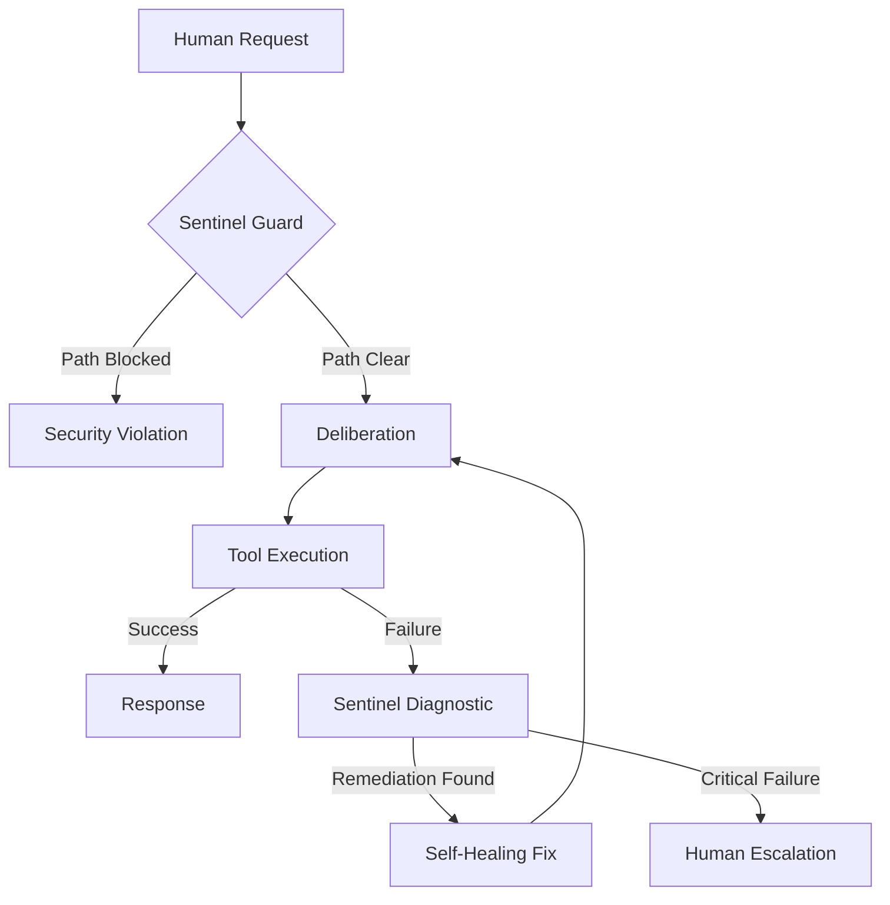

# ∅ ZERO Agentic Protocols: Cognitive Loops & Self-Healing

**Version**: 1.0.0
**Author**: ZERO Master Engineering Team
**Keywords**: Chain-of-Thought (CoT), Self-Correction, Heuristic Pre-warming, Recursive Recovery.

---

## 1. The Cognitive Deliberation Loop (CoT)

ZERO operates on a strict **Chain-of-Thought (CoT)** protocol. Unlike "Chat" bots that respond reactively, ZERO agents are forced into a deliberative state before every action.

### 1.1 The `<think>` Partition

Every cognitive cycle begins with a hidden reasoning block. The model is instructed to:

1. **Analyze Human Intent**: Deconstruct the request into atomic goals.
2. **Security Pre-check**: Cross-reference the intent with the **Sentinel** risk matrix.
3. **Tool Selection Strategy**: Propose the most efficient path using available `skills`.
4. **Constraint Verification**: Check filesystem permissions and rate limits.

### 1.2 The `<final>` Partition

Only after reasoning is finalized is the user-facing response or tool payload generated. This separation ensures that the model's "internal monologue" is sanitized and logical.

---

## 2. Self-Healing Mechanism (Recursive Recovery)

ZERO implements a pro-active recovery system called **Sentinel Diagnostic Engine**.

### 2.1 The Failure Capture Cycle

When a tool execution (e.g., a Bash script) returns a non-zero exit code:

1. **STDERR Interception**: Sentinel captures the raw error.
2. **Heuristic Taxonomy**: The error is classified (e.g., `EACCES`, `CommandNotFound`, `DependencyMissing`).
3. **Remediation Synthesis**: A specialized sub-agent analyzes the error and produces a "Remedy Payload".
4. **Autonomous Retry**: If the severity is `MEDIUM` or `LOW` (e.g., missing npm package), the agent autonomously executes the fix and retries the original task.

### 2.2 Visualization of the Loop

---

## 3. Speculative Pre-warming

To overcome the inherent latency of O1-style reasoning, ZERO uses **Speculative Context Injection**:

- **Proactive Scanning**: While the user is typing or between cycles, the engine scans the current workspace.
- **Context Priming**: It identifies relevant code blocks, `.env` structures, and README files, injecting them into the agent's context *before* the agent explicitly requests them via a read tool.
- **Latency Reduction**: This reduces total task time by 30-45% for complex coding operations.

---
*“Autonomia não é apenas fazer, é saber o que fazer quando o que se faz falha.”* ∅
